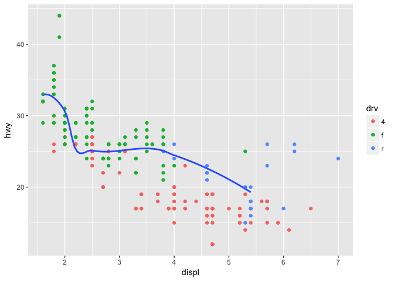
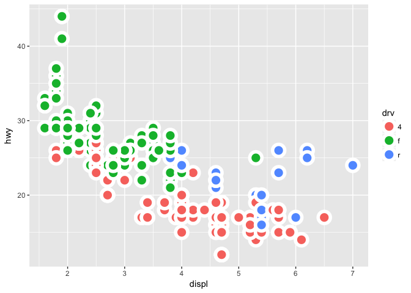
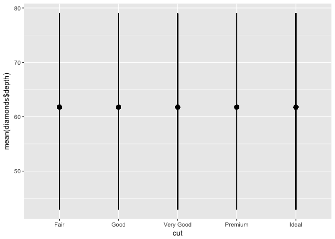
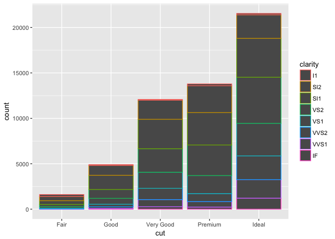

# Rmarkdown_HW_May3
Rongkui Han  
May 3, 2017  
####3.6 Geometric Objects

```r
library(tidyverse)
```

```
## Loading tidyverse: ggplot2
## Loading tidyverse: tibble
## Loading tidyverse: tidyr
## Loading tidyverse: readr
## Loading tidyverse: purrr
## Loading tidyverse: dplyr
```

```
## Conflicts with tidy packages ----------------------------------------------
```

```
## filter(): dplyr, stats
## lag():    dplyr, stats
```

```r
ggplot(data = mpg) + 
  geom_point(mapping = aes(x = displ, y = hwy))
```

<!-- -->

```r
ggplot(data = mpg) + 
  geom_smooth(mapping = aes(x = displ, y = hwy))
```

```
## `geom_smooth()` using method = 'loess'
```

<!-- -->

```r
ggplot(data = mpg) + 
  geom_smooth(mapping = aes(x = displ, y = hwy, linetype = drv, color = drv)) #this is really a funny looking plot. 
```

```
## `geom_smooth()` using method = 'loess'
```

<!-- -->

```r
ggplot(data = mpg) +
  geom_smooth(mapping = aes(x = displ, y = hwy, group = drv)) #"group" aesthetics just group the data according to a category and overlay each group on top of each other. it does not add a separate visual feature (e.g. colors/shape/legend etc.)
```

```
## `geom_smooth()` using method = 'loess'
```

<!-- -->

To display multiple geoms in the same plot:

```r
ggplot(data = mpg) + 
  geom_point(mapping = aes(x = displ, y = hwy)) +
  geom_smooth(mapping = aes(x = displ, y = hwy)) #wow
```

```
## `geom_smooth()` using method = 'loess'
```

<!-- -->

```r
#Or do this to eliminate duplication in code:
ggplot(data = mpg, mapping = aes(x = displ, y = hwy)) + #first line (ggplot()) for shared aesthetics
  geom_point(mapping = aes(color= drv)) + #and then each geom can have its unique aesthetics too
  geom_smooth(data = filter(mpg, class == "subcompact"), se = FALSE) # or even its own dataset. 
```

```
## `geom_smooth()` using method = 'loess'
```

<!-- -->

####3.6.1 Exercise  
#####1.   
line chart: geom_line(); boxplot: geom_boxplot(); histogram: geom_histogram(); area plot (I don't even know what this is): geom_area()   
#####2.   
I think this plot will look like a plot of engine displacement against mileage on highway, with different colors corresponding to different drives. There will be dots overlaid on top of a smooth line.  

```r
ggplot(data = mpg, mapping = aes(x = displ, y = hwy, color = drv)) + 
  geom_point() + 
  geom_smooth(se = FALSE)
```

```
## `geom_smooth()` using method = 'loess'
```

<!-- -->
#####3.    

```r
ggplot(data = mpg, mapping = aes(x = displ, y = hwy, color = drv), show.legend = FALSE) + 
  geom_point() + 
  geom_smooth(se = FALSE)
```

```
## `geom_smooth()` using method = 'loess'
```

<!-- -->

Hmm honestly I don't see where it's been used early in the chapter...  

#####4.   

```r
ggplot(data = mpg, mapping = aes(x = displ, y = hwy, color = drv), show.legend = FALSE) + 
  geom_point() + 
  geom_smooth(se = TRUE)
```

```
## `geom_smooth()` using method = 'loess'
```

<!-- -->

The se option add confidence interval zones around the smooth lines.  

#####5.   
I don't think they should look different. But let's take a look:  

```r
ggplot(data = mpg, mapping = aes(x = displ, y = hwy)) + 
  geom_point() + 
  geom_smooth()
```

```
## `geom_smooth()` using method = 'loess'
```

<!-- -->

```r
ggplot() + 
  geom_point(data = mpg, mapping = aes(x = displ, y = hwy)) + 
  geom_smooth(data = mpg, mapping = aes(x = displ, y = hwy))
```

```
## `geom_smooth()` using method = 'loess'
```

<!-- -->

Indeed they don't look like they are different.  

#####6.  

```r
ggplot(data = mpg, mapping = aes(x = displ, y = hwy)) + 
  geom_point() + 
  geom_smooth(se = FALSE)
```

```
## `geom_smooth()` using method = 'loess'
```

<!-- -->

```r
ggplot(data = mpg, mapping = aes(x = displ, y = hwy)) +
  geom_point() +
  geom_smooth(mapping = aes(group = drv), se = FALSE)
```

```
## `geom_smooth()` using method = 'loess'
```

<!-- -->

```r
ggplot(data = mpg, mapping = aes(x = displ, y = hwy, color = drv)) +
  geom_point() +
  geom_smooth(mapping = aes(group = drv), se = FALSE)
```

```
## `geom_smooth()` using method = 'loess'
```

<!-- -->

```r
ggplot(data = mpg, mapping = aes(x = displ, y = hwy)) +
  geom_point(mapping = aes(color = drv)) +
  geom_smooth(se = FALSE)
```

```
## `geom_smooth()` using method = 'loess'
```

<!-- -->

```r
ggplot(data = mpg, mapping = aes(x = displ, y = hwy)) +
  geom_point(mapping = aes(color = drv)) +
  geom_smooth(mapping = aes(linetype = drv),se = FALSE)
```

```
## `geom_smooth()` using method = 'loess'
```

<!-- -->

```r
ggplot(data = mpg) +
  geom_point(mapping = aes(x = displ, y = hwy, color = drv), size = 5) ##I'm not sure if I'm getting at what this question is asking for. How do you get the white "halo" around each dot??
```

<!-- -->

####3.7 Statistical Transformations

```r
ggplot(data = diamonds) + 
  geom_bar(mapping = aes(x = cut))
```

<!-- -->

```r
ggplot(data = diamonds) + 
  stat_count(mapping = aes(x = cut)) #wut! You can use geom and stats interchangeably! Because every geom has a default stat, and every stat has a default geom. 
```

<!-- -->

```r
#And you can override the stat:
ggplot(data = diamonds) + 
  geom_bar(mapping = aes(x = cut, y = ..prop.., group = 1)) # like specifying y = ..prop.. changes count to proportion. the dot part is kind of weird. What is group = 1?
```

<!-- -->

```r
ggplot(data = diamonds) + 
  stat_summary(
    mapping = aes(x = cut, y = depth),
    fun.ymin = min,
    fun.ymax = max,
    fun.y = median
  )
```

<!-- -->

####3.7.1 Exercise  
#####1.  
I'm thinking geom_linerange() or geom_pointrange(), but I'm not sure.  
#####2.  

```r
ggplot(data = diamonds) + 
  geom_col(mapping = aes(x = cut, y = price, color = clarity))
```

<!-- -->

```r
ggplot(data = diamonds) + 
  geom_bar(mapping = aes(x = cut, color = clarity))
```

<!-- -->

It looks like that geom_col has to take a y argument. It's default stat is not to count.   

#####3.  
I don't know if there is a go-to documentation for this.. but I found these pairs from [this webpage](http://sape.inf.usi.ch/quick-reference/ggplot2/geom):  
(geom-stat)  
abline-abline  
hline-hline  
vline-vline    
bar-bin  
boxplot-boxplot  
bin2d-bin2d  
hex-binhex  
density-density  
density2d-density2d  
contour-contour  
freqpoly-bin  
quantile-quantile   
smooth-smooth  
A lot of them have the same syntax.  

#####4.  

```r
?stat_smooth
```

it calculates:  
y: predicted value given x;  
ymin: lower pointwise confidence interval around the mean;  
ymax: upper pointwise confidence interval around the mean;  
se: standard error.  

Parameters:  
method: what linear regression model to use;  
formula: if you want to transform one of the input column (e.g. y ~ log(x));  
na.rm: if remove missing values;  
n: number of points to evaluate smoother at;  
level: level of confidence interval to use.  

#####5.   

```r
ggplot(data = diamonds) + 
  geom_bar(mapping = aes(x = cut, y = ..prop..))
```

<!-- -->

```r
ggplot(data = diamonds) + 
  geom_bar(mapping = aes(x = cut, fill = color, y = ..prop..))
```

<!-- -->

I think we need to set group = 1 because we want to find of the proportion of each x category in relation to the total population, not in relation to itself. Or the proportion is always gonna be 1. 

####3.8 Position Adjustments

```r
ggplot(data = diamonds) + 
  geom_bar(mapping = aes(x = cut, colour = cut))
```

<!-- -->

```r
ggplot(data = diamonds) + 
  geom_bar(mapping = aes(x = cut, fill = cut))
```

<!-- -->

```r
ggplot(data = diamonds) + 
  geom_bar(mapping = aes(x = cut, fill = clarity)) #automatic stacking of a second variable.
```

<!-- -->

```r
ggplot(data = diamonds, mapping = aes(x = cut, fill = clarity)) + 
  geom_bar(alpha = 1/5, position = "identity") # un-stacked. 
```

<!-- -->

```r
ggplot(data = diamonds, mapping = aes(x = cut, colour = clarity)) + 
  geom_bar(fill = NA, position = "identity") #un-stacked. Rather difficult to read. 
```

<!-- -->

```r
ggplot(data = diamonds) + 
  geom_bar(mapping = aes(x = cut, fill = clarity), position = "fill") # for comparing composition across different groups. 
```

<!-- -->

```r
ggplot(data = diamonds) + 
  geom_bar(mapping = aes(x = cut, fill = clarity), position = "dodge") # this is pretty
```

<!-- -->


