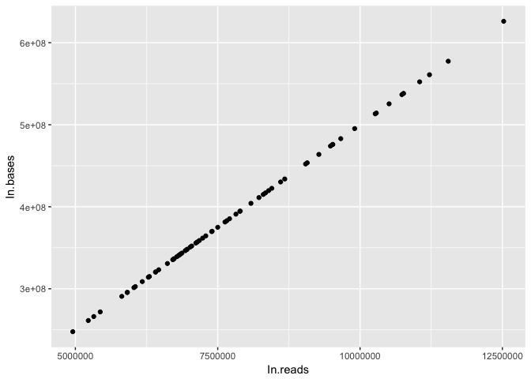
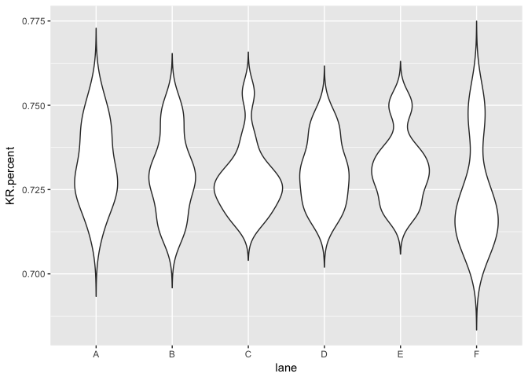

# Quality Check: RNA-seq data
Rongkui Han  
May 3, 2017  
###A Simple Dataset  
This dataset I am presenting here is a simple summary file from quality trimming 68 RNA-seq samples. I want to see if there is a row or column effect of where the sample was on the plate submitted for RNA-seq. 


```r
mydata = read.csv("/Users/apple/Desktop/UC_Davis/R_club/Rclub-r4ds_Rongkui.Han/R-club-Apr-26/Qtrimm.stat.csv")
mydata = mydata[,-1]
mydata$TR.percent = mydata$Trimmed.reads/mydata$In.reads
mydata$TB.percent = mydata$Trimmed.bases/mydata$In.bases
mydata$KR.percent = 1 - mydata$TR.percent
mydata$KB.percent = 1 - mydata$TB.percent
lane = c(rep("A",12), rep("B",12),rep("C",12), rep("D",12),rep("E",12),rep("F",8))
mydata = cbind(mydata,lane)
platecol = c(rep(c(1,2,3,4,5,6,7,8,9,10,11,12),5),1,2,3,4,5,6,7,8)
mydata = cbind(mydata, platecol)
library(tidyverse)
```

```
## Loading tidyverse: ggplot2
## Loading tidyverse: tibble
## Loading tidyverse: tidyr
## Loading tidyverse: readr
## Loading tidyverse: purrr
## Loading tidyverse: dplyr
```

```
## Conflicts with tidy packages ----------------------------------------------
```

```
## filter(): dplyr, stats
## lag():    dplyr, stats
```

#####First I want to take a look at how the base numbers relate to the read numbers.  

```r
ggplot(data = mydata) +
  geom_point(mapping = aes(x = In.reads, y = In.bases))
```

<!-- -->

It looks like they have a strict linear relationship, which probably means that there are a fix number of base pairs per RNA read. Now we are going to figure out what that number is:

```r
model = lm(mydata$In.bases ~ mydata$In.reads)
model
```

```
## 
## Call:
## lm(formula = mydata$In.bases ~ mydata$In.reads)
## 
## Coefficients:
##     (Intercept)  mydata$In.reads  
##       1.156e-07        5.000e+01
```
From the simple linear regression model we can see that there is approximately 50 base pairs in a read.  

#####Second, we want to see the distribution of percentage of bases kept after the trimming process by each lane where the RNA-seq was done.

```r
ggplot(data = mydata) +
  geom_violin(mapping = aes(x = lane, y = KR.percent), trim = FALSE)
```

<!-- -->

These look relatively similar to each other.   

#####Then we can do a similar analysis to see if there is a column effect.

```r
mydata$platecol = as.factor(mydata$platecol)
ggplot(data = mydata) +
  geom_violin(mapping = aes(x = platecol, y = KR.percent), trim = FALSE)
```

<!-- -->

This is an interesting plot. It looks like centain columns generated RNA reads with more stable qualities than others. 


