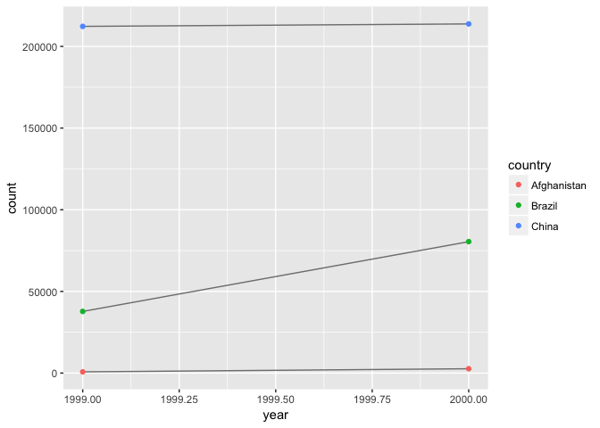

# HW_June_14
Rongkui Han  
June 14, 2017  

```r
library(tidyverse)
```

```
## Loading tidyverse: ggplot2
## Loading tidyverse: tibble
## Loading tidyverse: tidyr
## Loading tidyverse: readr
## Loading tidyverse: purrr
## Loading tidyverse: dplyr
```

```
## Conflicts with tidy packages ----------------------------------------------
```

```
## filter(): dplyr, stats
## lag():    dplyr, stats
```

###12.2 Tidy data  

There interrelated rulws which make a dataset tidy:  
1. Each variable bust have its own column.  
2. Each observation must have its own row.  
3. Each value must have its own cell.  

####12.2.1 Exercises  
1. Using prose (?), describe how the variables and observations are organized in each sample table.  
 *table1: Each variable has a column and each observation has a row.*  
*table2: the two vatiables "cases" and "population" shared a column.*  
*table3: the values for cases and population shared a column.*  
*table4: could be merged into one table.*  

2. Compute the rate for table2, and table4a + table 4b. You will need to perform four operations:  
  1. Extract the number of TB cases per country per year.  
  2. Extract the matching population per country per year.  
  3. Divide cases by population, and multiply by 10000.  
  4. Store back in the appropriate place.  
Which representation is easiest to work with? Which is hardest? Why?  

```r
#tables 1 & 2
table1 = tibble("country" = c("Afghanistan", "Afghanistan","Brazil","Brazil","China","China"), "year" = c(1999,2000,1999,2000,1999,2000), "cases" = c(745, 2666, 37737, 80488, 212258, 213766), "population" = c(19987371,20595360, 172006362, 174504898, 1272915272, 1280428583),"rate" = c(0.373, 1.294, 2.194, 4.612, 1.667, 1.669))
table1
```

```
## # A tibble: 6 x 5
##       country  year  cases population  rate
##         <chr> <dbl>  <dbl>      <dbl> <dbl>
## 1 Afghanistan  1999    745   19987371 0.373
## 2 Afghanistan  2000   2666   20595360 1.294
## 3      Brazil  1999  37737  172006362 2.194
## 4      Brazil  2000  80488  174504898 4.612
## 5       China  1999 212258 1272915272 1.667
## 6       China  2000 213766 1280428583 1.669
```

```r
table2 = tibble("country" = c("Afghanistan", "Afghanistan","Afghanistan", "Afghanistan","Brazil","Brazil","Brazil","Brazil","China","China", "China","China"), "year" = c(1999,1999,2000,2000,1999,1999,2000,2000,1999,1999,2000,2000), "type" = c("cases","population", "cases","population","cases","population","cases","population", "cases","population","cases","population"), "count" = c(745, 19987371, 2666, 20595360, 37737, 172006362, 80488, 174504898, 212258, 1272915272, 213766, 1280428583))
table2
```

```
## # A tibble: 12 x 4
##        country  year       type      count
##          <chr> <dbl>      <chr>      <dbl>
##  1 Afghanistan  1999      cases        745
##  2 Afghanistan  1999 population   19987371
##  3 Afghanistan  2000      cases       2666
##  4 Afghanistan  2000 population   20595360
##  5      Brazil  1999      cases      37737
##  6      Brazil  1999 population  172006362
##  7      Brazil  2000      cases      80488
##  8      Brazil  2000 population  174504898
##  9       China  1999      cases     212258
## 10       China  1999 population 1272915272
## 11       China  2000      cases     213766
## 12       China  2000 population 1280428583
```

```r
t1cases = table1["cases"]
t1cases
```

```
## # A tibble: 6 x 1
##    cases
##    <dbl>
## 1    745
## 2   2666
## 3  37737
## 4  80488
## 5 212258
## 6 213766
```

```r
t2cases = table2[table2$type=="cases","count"]
t2cases
```

```
## # A tibble: 6 x 1
##    count
##    <dbl>
## 1    745
## 2   2666
## 3  37737
## 4  80488
## 5 212258
## 6 213766
```

```r
t1pop = table1["population"]
t1pop
```

```
## # A tibble: 6 x 1
##   population
##        <dbl>
## 1   19987371
## 2   20595360
## 3  172006362
## 4  174504898
## 5 1272915272
## 6 1280428583
```

```r
t2pop = table2[table2$type=="population","count"]
t2pop
```

```
## # A tibble: 6 x 1
##        count
##        <dbl>
## 1   19987371
## 2   20595360
## 3  172006362
## 4  174504898
## 5 1272915272
## 6 1280428583
```

```r
t1rate = t1cases/t1pop * 10000
t1rate
```

```
##       cases
## 1 0.3727354
## 2 1.2944663
## 3 2.1939305
## 4 4.6123634
## 5 1.6674951
## 6 1.6694879
```

```r
t2rate = t2cases/t2pop * 10000
t2rate
```

```
##       count
## 1 0.3727354
## 2 1.2944663
## 3 2.1939305
## 4 4.6123634
## 5 1.6674951
## 6 1.6694879
```

```r
table1[["new.rate"]] = t1rate
info = tibble("country" = c("Afghanistan", "Afghanistan","Brazil","Brazil","China","China"), "year" = c(1999,2000,1999,2000,1999,2000), "type" = c("rate", "rate", "rate", "rate", "rate", "rate"))
info = cbind(info,t2rate)
table2 = rbind(table2, info)
##table 4
table4a = tibble("county" = c("Afghanistan","Brazil","China"), "`1999`" = c(745, 37737, 212258), "`2000`" = c(2666, 80488, 213766))
table4a
```

```
## # A tibble: 3 x 3
##        county `\`1999\`` `\`2000\``
##         <chr>      <dbl>      <dbl>
## 1 Afghanistan        745       2666
## 2      Brazil      37737      80488
## 3       China     212258     213766
```

```r
table4b = tibble("county" = c("Afghanistan","Brazil","China"), "`1999`" = c(19987371,172006362,1272915272), "`2000`" = c(20595360,174504898,1280428583))
table4b
```

```
## # A tibble: 3 x 3
##        county `\`1999\`` `\`2000\``
##         <chr>      <dbl>      <dbl>
## 1 Afghanistan   19987371   20595360
## 2      Brazil  172006362  174504898
## 3       China 1272915272 1280428583
```

```r
rate1999 = table4a[["`1999`"]]/table4b[["`1999`"]] 
rate2000 = table4a[["`2000`"]]/table4b[["`2000`"]] 
table4c = tibble("county" = c("Afghanistan","Brazil","China"), "`1999`" = rate1999, "`2000`" = rate2000)
```

table 2 is very painfrul to work with, especially when I was trying to incorporate the generated data back to the original table. tables 4a and 4b are pretty bad too. A lot of copying and pasting was involved.  

3. Recreat the plot showing change in cases over time using table2 instead of table1. What do you need to do first?  

```r
library(ggplot2)
ggplot(table1, aes(year, cases)) + 
  geom_line(aes(group = country), colour = "grey50") + 
  geom_point(aes(colour = country))
```

<!-- -->

I first need to subset table 2 and get all the cases counts.   

```r
table2cases = table2[table2$type == "cases",]
table2cases
```

```
## # A tibble: 6 x 4
##       country  year  type  count
##         <chr> <dbl> <chr>  <dbl>
## 1 Afghanistan  1999 cases    745
## 2 Afghanistan  2000 cases   2666
## 3      Brazil  1999 cases  37737
## 4      Brazil  2000 cases  80488
## 5       China  1999 cases 212258
## 6       China  2000 cases 213766
```

```r
ggplot(table2cases, mapping = aes(year, count)) +
  geom_line(aes(group = country), colour = "grey50") + 
  geom_point(aes(colour = country))
```

<!-- -->

####12.3.1 Gathering  

```r
table4a
```

```
## # A tibble: 3 x 3
##        county `\`1999\`` `\`2000\``
##         <chr>      <dbl>      <dbl>
## 1 Afghanistan        745       2666
## 2      Brazil      37737      80488
## 3       China     212258     213766
```

```r
#table4a %>%
#  gather(`1999`, `2000`, key = "year", value = "cases")
#Didn't work for me =(
#table4b %>%
#  gather(`1999`, `2000`, key = "year", value = "population")
#Error: object `1999` not found
```
####12.3.2 Spreading  

```r
spread(table2, key = type, value = count)
```

```
## # A tibble: 6 x 5
##       country  year  cases population      rate
## *       <chr> <dbl>  <dbl>      <dbl>     <dbl>
## 1 Afghanistan  1999    745   19987371 0.3727354
## 2 Afghanistan  2000   2666   20595360 1.2944663
## 3      Brazil  1999  37737  172006362 2.1939305
## 4      Brazil  2000  80488  174504898 4.6123634
## 5       China  1999 212258 1272915272 1.6674951
## 6       China  2000 213766 1280428583 1.6694879
```

####12.3.3 Exercises
1. Why are gather() and spread() not perfectly symmetrical? Carfully consider the following example:  

```r
stocks <- tibble(
  year   = c(2015, 2015, 2016, 2016),
  half  = c(   1,    2,     1,    2),
  return = c(1.88, 0.59, 0.92, 0.17)
)
stocks
```

```
## # A tibble: 4 x 3
##    year  half return
##   <dbl> <dbl>  <dbl>
## 1  2015     1   1.88
## 2  2015     2   0.59
## 3  2016     1   0.92
## 4  2016     2   0.17
```

```r
stocks %>% 
  spread(year, return) %>% 
  gather("year", "return", `2015`:`2016`)
```

```
## # A tibble: 4 x 3
##    half  year return
##   <dbl> <chr>  <dbl>
## 1     1  2015   1.88
## 2     2  2015   0.59
## 3     1  2016   0.92
## 4     2  2016   0.17
```

For gather(), you need to specify more than one columns to gather together, and give it a designated column name. For spread() you only need to specify one column to separate, and the new column names are contained in the original column already.  


```r
?spread()
```

It sounds like this concerns the type of the value... but i'm not entirely sure.  

2. Why does this code fail?  

```r
table4a %>% 
  gather(1999, 2000, key = "year", value = "cases")
```

1999 and 2000 need to be `1999` and `2000`

3. Why does spreading this tibble fail? How could you add a new column to fix it?  
*I think it might be because there are two Phillip Woods + age combos with different age values. I can fix it by adding a column the differ in value for the duplicated entries.*    

```r
people <- tribble(
  ~name,             ~key,    ~value,
  #-----------------|--------|------
  "Phillip Woods",   "age",       45,
  "Phillip Woods",   "height",   186,
  "Phillip Woods",   "age",       50,
  "Jessica Cordero", "age",       37,
  "Jessica Cordero", "height",   156
)
people %>%
  mutate(thing = c(1,1,2,1,1)) %>%
  spread(key = key, value = value)
```

```
## # A tibble: 3 x 4
##              name thing   age height
## *           <chr> <dbl> <dbl>  <dbl>
## 1 Jessica Cordero     1    37    156
## 2   Phillip Woods     1    45    186
## 3   Phillip Woods     2    50     NA
```

4. Tidy the simple tibble below. Do you need to spread or gather it? Whhat are teh variables?  

```r
preg <- tribble(
  ~pregnant, ~male, ~female,
  "yes",     NA,    10,
  "no",      20,    12
)
preg %>%
  gather(male, female, key = "gender", value = "count")
```

```
## # A tibble: 4 x 3
##   pregnant gender count
##      <chr>  <chr> <dbl>
## 1      yes   male    NA
## 2       no   male    20
## 3      yes female    10
## 4       no female    12
```

I gathered it but i'm not sure if that's all I can do.  

###12.4 Separating and uniting  

####12.4.1 Separate  

```r
table3 = tibble("country" = c("Afghanistan", "Afghanistan","Brazil","Brazil","China","China"), "year" = c(1999,2000,1999,2000,1999,2000), "rate" = c("745/19987371","2666/20595360" , "37737/172006362", "80488/174504898", "212258/1272915272", "213766/1280428583"))
table3 %>%
  separate(rate, into = c("cases","population"))
```

```
## # A tibble: 6 x 4
##       country  year  cases population
## *       <chr> <dbl>  <chr>      <chr>
## 1 Afghanistan  1999    745   19987371
## 2 Afghanistan  2000   2666   20595360
## 3      Brazil  1999  37737  172006362
## 4      Brazil  2000  80488  174504898
## 5       China  1999 212258 1272915272
## 6       China  2000 213766 1280428583
```

```r
table3 %>%
  separate(rate, into = c("cases","population"), sep = "/")
```

```
## # A tibble: 6 x 4
##       country  year  cases population
## *       <chr> <dbl>  <chr>      <chr>
## 1 Afghanistan  1999    745   19987371
## 2 Afghanistan  2000   2666   20595360
## 3      Brazil  1999  37737  172006362
## 4      Brazil  2000  80488  174504898
## 5       China  1999 212258 1272915272
## 6       China  2000 213766 1280428583
```

```r
table3 %>%
  separate(rate, into = c("cases","population"), convert = TRUE)
```

```
## # A tibble: 6 x 4
##       country  year  cases population
## *       <chr> <dbl>  <int>      <int>
## 1 Afghanistan  1999    745   19987371
## 2 Afghanistan  2000   2666   20595360
## 3      Brazil  1999  37737  172006362
## 4      Brazil  2000  80488  174504898
## 5       China  1999 212258 1272915272
## 6       China  2000 213766 1280428583
```

```r
table5 = table3 %>%
  separate(year, into = c("century","year"), sep = 2)
```

####12.4.2 Unite  

```r
table5 %>%
  unite(new, century, year, sep = "")
```

```
## # A tibble: 6 x 3
##       country   new              rate
## *       <chr> <chr>             <chr>
## 1 Afghanistan  1999      745/19987371
## 2 Afghanistan  2000     2666/20595360
## 3      Brazil  1999   37737/172006362
## 4      Brazil  2000   80488/174504898
## 5       China  1999 212258/1272915272
## 6       China  2000 213766/1280428583
```

####12.4.3Exercises   
1. What do the `extra` and `fill` arguments do in `separate()`? Experiment with the various options for the following two toy datasets.   

```r
?separate()
tibble(x = c("a,b,c", "d,e,f,g", "h,i,j")) %>% 
  separate(x, c("one", "two", "three"))
```

```
## Warning: Too many values at 1 locations: 2
```

```
## # A tibble: 3 x 3
##     one   two three
## * <chr> <chr> <chr>
## 1     a     b     c
## 2     d     e     f
## 3     h     i     j
```

```r
tibble(x = c("a,b,c", "d,e,f,g", "h,i,j")) %>% 
  separate(x, c("one", "two", "three"), extra = "drop")
```

```
## # A tibble: 3 x 3
##     one   two three
## * <chr> <chr> <chr>
## 1     a     b     c
## 2     d     e     f
## 3     h     i     j
```

```r
tibble(x = c("a,b,c", "d,e,f,g", "h,i,j")) %>% 
  separate(x, c("one", "two", "three"), extra = "merge")
```

```
## # A tibble: 3 x 3
##     one   two three
## * <chr> <chr> <chr>
## 1     a     b     c
## 2     d     e   f,g
## 3     h     i     j
```

```r
tibble(x = c("a,b,c", "d,e", "f,g,i")) %>% 
  separate(x, c("one", "two", "three"))
```

```
## Warning: Too few values at 1 locations: 2
```

```
## # A tibble: 3 x 3
##     one   two three
## * <chr> <chr> <chr>
## 1     a     b     c
## 2     d     e  <NA>
## 3     f     g     i
```

```r
tibble(x = c("a,b,c", "d,e", "f,g,i")) %>% 
  separate(x, c("one", "two", "three"), fill = "left")
```

```
## # A tibble: 3 x 3
##     one   two three
## * <chr> <chr> <chr>
## 1     a     b     c
## 2  <NA>     d     e
## 3     f     g     i
```

```r
tibble(x = c("a,b,c", "d,e", "f,g,i")) %>% 
  separate(x, c("one", "two", "three"), fill = "right")
```

```
## # A tibble: 3 x 3
##     one   two three
## * <chr> <chr> <chr>
## 1     a     b     c
## 2     d     e  <NA>
## 3     f     g     i
```

2. Both `unite()` and `separate()` have a `remove` argument. What does it do? Why would you set it to `FALSE`?  

```r
tibble(x = c("a,b,c", "d,e", "f,g,i")) %>% 
  separate(x, c("one", "two", "three"), fill = "right", remove = FALSE)
```

```
## # A tibble: 3 x 4
##       x   one   two three
## * <chr> <chr> <chr> <chr>
## 1 a,b,c     a     b     c
## 2   d,e     d     e  <NA>
## 3 f,g,i     f     g     i
```

It removes the new table from the original table. If you set it to FALSE you will get a table that is a combination of the original and the transformed table.  

3. Compare and contrast `separate()` and `extract()`. Why are there three variations of separation (by position, by separator and with groups), but only one unite? 


```r
?extract()
```

```
## Help on topic 'extract' was found in the following packages:
## 
##   Package               Library
##   tidyr                 /Library/Frameworks/R.framework/Versions/3.3/Resources/library
##   magrittr              /Library/Frameworks/R.framework/Versions/3.3/Resources/library
## 
## 
## Using the first match ...
```

```r
tibble(x = c("a,b,c", "d,e,f", "g,h,i")) %>% 
  extract(x, "A")
```

```
## # A tibble: 3 x 1
##       A
## * <chr>
## 1     a
## 2     d
## 3     g
```

It looks like you can only extract one volume at a time with extract? 
 
