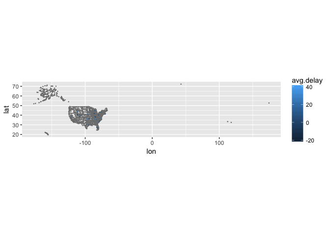
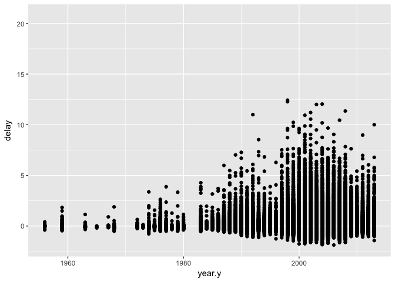
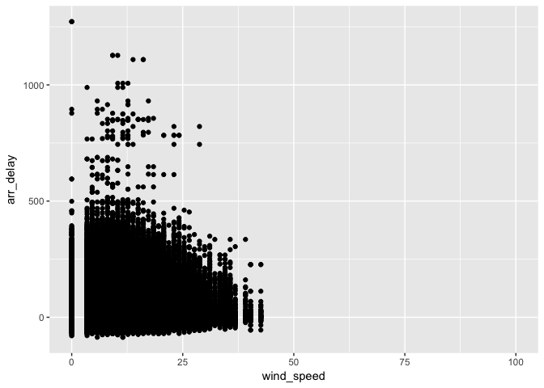
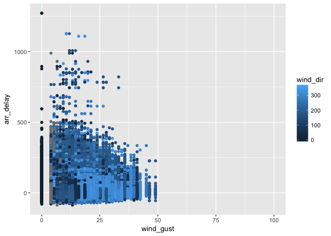
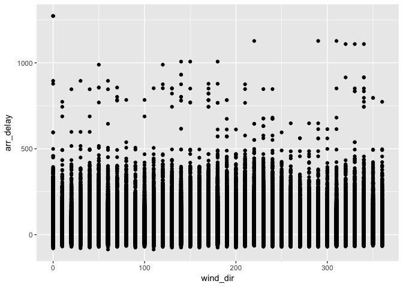
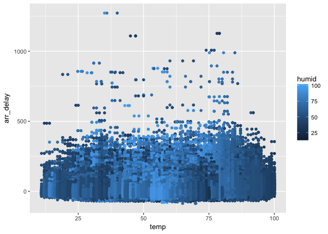
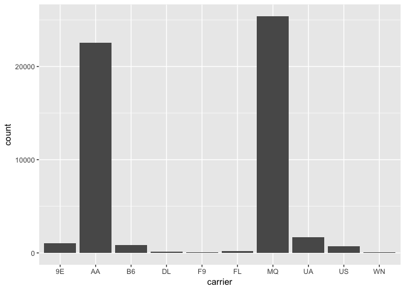
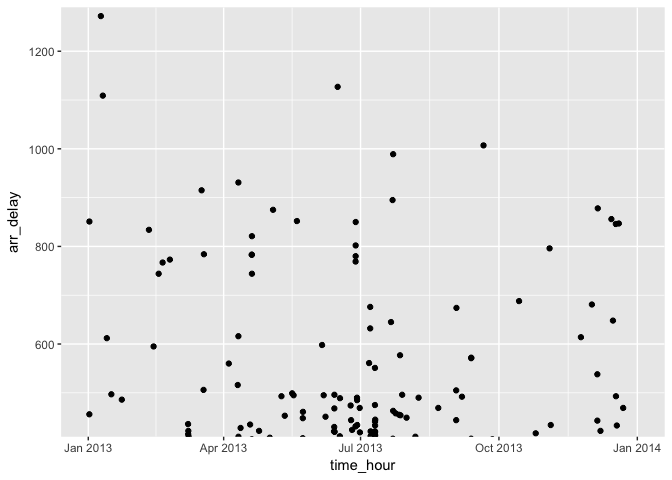

# HW_June_28
Rongkui Han  
June 28, 2017  


```r
library(tidyverse)
```

```
## Loading tidyverse: ggplot2
## Loading tidyverse: tibble
## Loading tidyverse: tidyr
## Loading tidyverse: readr
## Loading tidyverse: purrr
## Loading tidyverse: dplyr
```

```
## Conflicts with tidy packages ----------------------------------------------
```

```
## filter(): dplyr, stats
## lag():    dplyr, stats
```

```r
library(nycflights13)
```

###13.3 Keys   

Checking for unique keys (primary keys):  

```r
planes %>%
  count(tailnum) %>%
  filter(n>1)
```

```
## # A tibble: 0 x 2
## # ... with 2 variables: tailnum <chr>, n <int>
```

```r
weather %>%
  count(year, month, day, hour, origin) %>%
  filter(n > 1)
```

```
## Source: local data frame [0 x 6]
## Groups: year, month, day, hour [0]
## 
## # A tibble: 0 x 6
## # ... with 6 variables: year <dbl>, month <dbl>, day <int>, hour <int>,
## #   origin <chr>, n <int>
```

Or the lack thereof:  

```r
flights %>%
  count(year, month, day, flight) %>%
  filter(n > 1)
```

```
## Source: local data frame [29,768 x 5]
## Groups: year, month, day [365]
## 
## # A tibble: 29,768 x 5
##     year month   day flight     n
##    <int> <int> <int>  <int> <int>
##  1  2013     1     1      1     2
##  2  2013     1     1      3     2
##  3  2013     1     1      4     2
##  4  2013     1     1     11     3
##  5  2013     1     1     15     2
##  6  2013     1     1     21     2
##  7  2013     1     1     27     4
##  8  2013     1     1     31     2
##  9  2013     1     1     32     2
## 10  2013     1     1     35     2
## # ... with 29,758 more rows
```

```r
flights %>%
  count(year, month, day, tailnum) %>%
  filter(n > 1)
```

```
## Source: local data frame [64,928 x 5]
## Groups: year, month, day [365]
## 
## # A tibble: 64,928 x 5
##     year month   day tailnum     n
##    <int> <int> <int>   <chr> <int>
##  1  2013     1     1  N0EGMQ     2
##  2  2013     1     1  N11189     2
##  3  2013     1     1  N11536     2
##  4  2013     1     1  N11544     3
##  5  2013     1     1  N11551     2
##  6  2013     1     1  N12540     2
##  7  2013     1     1  N12567     2
##  8  2013     1     1  N13123     2
##  9  2013     1     1  N13538     3
## 10  2013     1     1  N13566     3
## # ... with 64,918 more rows
```

####13.3.1 Exercises    
1. Add a surrogate key to flights.  

```r
?row_number()
primary_flights = flights %>%
  mutate(surrogate_key = row_number(flight))
primary_flights
```

```
## # A tibble: 336,776 x 20
##     year month   day dep_time sched_dep_time dep_delay arr_time
##    <int> <int> <int>    <int>          <int>     <dbl>    <int>
##  1  2013     1     1      517            515         2      830
##  2  2013     1     1      533            529         4      850
##  3  2013     1     1      542            540         2      923
##  4  2013     1     1      544            545        -1     1004
##  5  2013     1     1      554            600        -6      812
##  6  2013     1     1      554            558        -4      740
##  7  2013     1     1      555            600        -5      913
##  8  2013     1     1      557            600        -3      709
##  9  2013     1     1      557            600        -3      838
## 10  2013     1     1      558            600        -2      753
## # ... with 336,766 more rows, and 13 more variables: sched_arr_time <int>,
## #   arr_delay <dbl>, carrier <chr>, flight <int>, tailnum <chr>,
## #   origin <chr>, dest <chr>, air_time <dbl>, distance <dbl>, hour <dbl>,
## #   minute <dbl>, time_hour <dttm>, surrogate_key <int>
```
2. Identify the keys in the following datasets:  

```r
head(Lahman::Batting)
```

```
##    playerID yearID stint teamID lgID  G  AB  R  H X2B X3B HR RBI SB CS BB
## 1 abercda01   1871     1    TRO   NA  1   4  0  0   0   0  0   0  0  0  0
## 2  addybo01   1871     1    RC1   NA 25 118 30 32   6   0  0  13  8  1  4
## 3 allisar01   1871     1    CL1   NA 29 137 28 40   4   5  0  19  3  1  2
## 4 allisdo01   1871     1    WS3   NA 27 133 28 44  10   2  2  27  1  1  0
## 5 ansonca01   1871     1    RC1   NA 25 120 29 39  11   3  0  16  6  2  2
## 6 armstbo01   1871     1    FW1   NA 12  49  9 11   2   1  0   5  0  1  0
##   SO IBB HBP SH SF GIDP
## 1  0  NA  NA NA NA   NA
## 2  0  NA  NA NA NA   NA
## 3  5  NA  NA NA NA   NA
## 4  2  NA  NA NA NA   NA
## 5  1  NA  NA NA NA   NA
## 6  1  NA  NA NA NA   NA
```

```r
Lahman::Batting %>%
  count(playerID) %>%
  filter(n > 1) #foreign key? Not a primary key.
```

```
## # A tibble: 13,665 x 2
##     playerID     n
##        <chr> <int>
##  1 aardsda01     9
##  2 aaronha01    23
##  3 aaronto01     7
##  4  aasedo01    13
##  5  abadan01     3
##  6  abadfe01     6
##  7 abadijo01     2
##  8 abbated01    10
##  9 abbeybe01     6
## 10 abbeych01     5
## # ... with 13,655 more rows
```

```r
Lahman::Batting %>%
  count(teamID) %>%
  filter(n > 1) #foreign key? Not a primary key.
```

```
## # A tibble: 149 x 2
##    teamID     n
##    <fctr> <int>
##  1    ALT    17
##  2    ANA   337
##  3    ARI   830
##  4    ATL  2050
##  5    BAL  2518
##  6    BFN   122
##  7    BFP    26
##  8    BL1    48
##  9    BL2   197
## 10    BL3    36
## # ... with 139 more rows
```

```r
ggplot2::diamonds
```

```
## # A tibble: 53,940 x 10
##    carat       cut color clarity depth table price     x     y     z
##    <dbl>     <ord> <ord>   <ord> <dbl> <dbl> <int> <dbl> <dbl> <dbl>
##  1  0.23     Ideal     E     SI2  61.5    55   326  3.95  3.98  2.43
##  2  0.21   Premium     E     SI1  59.8    61   326  3.89  3.84  2.31
##  3  0.23      Good     E     VS1  56.9    65   327  4.05  4.07  2.31
##  4  0.29   Premium     I     VS2  62.4    58   334  4.20  4.23  2.63
##  5  0.31      Good     J     SI2  63.3    58   335  4.34  4.35  2.75
##  6  0.24 Very Good     J    VVS2  62.8    57   336  3.94  3.96  2.48
##  7  0.24 Very Good     I    VVS1  62.3    57   336  3.95  3.98  2.47
##  8  0.26 Very Good     H     SI1  61.9    55   337  4.07  4.11  2.53
##  9  0.22      Fair     E     VS2  65.1    61   337  3.87  3.78  2.49
## 10  0.23 Very Good     H     VS1  59.4    61   338  4.00  4.05  2.39
## # ... with 53,930 more rows
```

```r
#There is no primary key (unique identifier) in this table. 
```

3.   

```r
head(Lahman::Batting)
```

```
##    playerID yearID stint teamID lgID  G  AB  R  H X2B X3B HR RBI SB CS BB
## 1 abercda01   1871     1    TRO   NA  1   4  0  0   0   0  0   0  0  0  0
## 2  addybo01   1871     1    RC1   NA 25 118 30 32   6   0  0  13  8  1  4
## 3 allisar01   1871     1    CL1   NA 29 137 28 40   4   5  0  19  3  1  2
## 4 allisdo01   1871     1    WS3   NA 27 133 28 44  10   2  2  27  1  1  0
## 5 ansonca01   1871     1    RC1   NA 25 120 29 39  11   3  0  16  6  2  2
## 6 armstbo01   1871     1    FW1   NA 12  49  9 11   2   1  0   5  0  1  0
##   SO IBB HBP SH SF GIDP
## 1  0  NA  NA NA NA   NA
## 2  0  NA  NA NA NA   NA
## 3  5  NA  NA NA NA   NA
## 4  2  NA  NA NA NA   NA
## 5  1  NA  NA NA NA   NA
## 6  1  NA  NA NA NA   NA
```

```r
head(Lahman::Master)
```

```
##    playerID birthYear birthMonth birthDay birthCountry birthState
## 1 aardsda01      1981         12       27          USA         CO
## 2 aaronha01      1934          2        5          USA         AL
## 3 aaronto01      1939          8        5          USA         AL
## 4  aasedo01      1954          9        8          USA         CA
## 5  abadan01      1972          8       25          USA         FL
## 6  abadfe01      1985         12       17         D.R.  La Romana
##    birthCity deathYear deathMonth deathDay deathCountry deathState
## 1     Denver        NA         NA       NA         <NA>       <NA>
## 2     Mobile        NA         NA       NA         <NA>       <NA>
## 3     Mobile      1984          8       16          USA         GA
## 4     Orange        NA         NA       NA         <NA>       <NA>
## 5 Palm Beach        NA         NA       NA         <NA>       <NA>
## 6  La Romana        NA         NA       NA         <NA>       <NA>
##   deathCity nameFirst nameLast        nameGiven weight height bats throws
## 1      <NA>     David  Aardsma      David Allan    220     75    R      R
## 2      <NA>      Hank    Aaron      Henry Louis    180     72    R      R
## 3   Atlanta    Tommie    Aaron       Tommie Lee    190     75    R      R
## 4      <NA>       Don     Aase   Donald William    190     75    R      R
## 5      <NA>      Andy     Abad    Fausto Andres    184     73    L      L
## 6      <NA>  Fernando     Abad Fernando Antonio    220     73    L      L
##        debut  finalGame  retroID   bbrefID  deathDate  birthDate
## 1 2004-04-06 2015-08-23 aardd001 aardsda01       <NA> 1981-12-27
## 2 1954-04-13 1976-10-03 aaroh101 aaronha01       <NA> 1934-02-05
## 3 1962-04-10 1971-09-26 aarot101 aaronto01 1984-08-16 1939-08-05
## 4 1977-07-26 1990-10-03 aased001  aasedo01       <NA> 1954-09-08
## 5 2001-09-10 2006-04-13 abada001  abadan01       <NA> 1972-08-25
## 6 2010-07-28 2015-10-03 abadf001  abadfe01       <NA> 1985-12-17
```

```r
head(Lahman::Managers)
```

```
##    playerID yearID teamID lgID inseason  G  W  L rank plyrMgr
## 1 wrighha01   1871    BS1   NA        1 31 20 10    3       Y
## 2  woodji01   1871    CH1   NA        1 28 19  9    2       Y
## 3 paborch01   1871    CL1   NA        1 29 10 19    8       Y
## 4 lennobi01   1871    FW1   NA        1 14  5  9    8       Y
## 5 deaneha01   1871    FW1   NA        2  5  2  3    8       Y
## 6 fergubo01   1871    NY2   NA        1 33 16 17    5       Y
```

```r
Lahman::Master %>%
  count(playerID) %>%
  filter(n>1)
```

```
## # A tibble: 0 x 2
## # ... with 2 variables: playerID <chr>, n <int>
```

```r
Lahman::Batting %>%
  count(playerID) %>%
  filter(n>1)
```

```
## # A tibble: 13,665 x 2
##     playerID     n
##        <chr> <int>
##  1 aardsda01     9
##  2 aaronha01    23
##  3 aaronto01     7
##  4  aasedo01    13
##  5  abadan01     3
##  6  abadfe01     6
##  7 abadijo01     2
##  8 abbated01    10
##  9 abbeybe01     6
## 10 abbeych01     5
## # ... with 13,655 more rows
```

```r
Lahman::Managers %>%
  count(playerID) %>%
  filter(n>1)
```

```
## # A tibble: 464 x 2
##     playerID     n
##        <chr> <int>
##  1  actama99     6
##  2  addybo01     2
##  3 allenbo01     2
##  4  aloufe01    14
##  5 alstowa01    23
##  6 altobjo01     7
##  7 amalfjo01     3
##  8 andersp01    26
##  9 ansonca01    21
## 10 armoubi99     5
## # ... with 454 more rows
```

Both Batting and Managers contain the foreign key "playerID" that is a primary keys in Master.   

###13.4 Mutating joins  

```r
flights2 = flights %>%
  select(year:day, hour, origin, dest, tailnum, carrier)
flights2 %>%
  select(-origin, -dest) %>%
  left_join(airlines, by = "carrier")
```

```
## # A tibble: 336,776 x 7
##     year month   day  hour tailnum carrier                     name
##    <int> <int> <int> <dbl>   <chr>   <chr>                    <chr>
##  1  2013     1     1     5  N14228      UA    United Air Lines Inc.
##  2  2013     1     1     5  N24211      UA    United Air Lines Inc.
##  3  2013     1     1     5  N619AA      AA   American Airlines Inc.
##  4  2013     1     1     5  N804JB      B6          JetBlue Airways
##  5  2013     1     1     6  N668DN      DL     Delta Air Lines Inc.
##  6  2013     1     1     5  N39463      UA    United Air Lines Inc.
##  7  2013     1     1     6  N516JB      B6          JetBlue Airways
##  8  2013     1     1     6  N829AS      EV ExpressJet Airlines Inc.
##  9  2013     1     1     6  N593JB      B6          JetBlue Airways
## 10  2013     1     1     6  N3ALAA      AA   American Airlines Inc.
## # ... with 336,766 more rows
```

```r
flights2 %>% #this is the equivalent of the left_join() function
  select(-origin, -dest) %>%
  mutate(name = airlines$name[match(carrier, airlines$carrier)])
```

```
## # A tibble: 336,776 x 7
##     year month   day  hour tailnum carrier                     name
##    <int> <int> <int> <dbl>   <chr>   <chr>                    <chr>
##  1  2013     1     1     5  N14228      UA    United Air Lines Inc.
##  2  2013     1     1     5  N24211      UA    United Air Lines Inc.
##  3  2013     1     1     5  N619AA      AA   American Airlines Inc.
##  4  2013     1     1     5  N804JB      B6          JetBlue Airways
##  5  2013     1     1     6  N668DN      DL     Delta Air Lines Inc.
##  6  2013     1     1     5  N39463      UA    United Air Lines Inc.
##  7  2013     1     1     6  N516JB      B6          JetBlue Airways
##  8  2013     1     1     6  N829AS      EV ExpressJet Airlines Inc.
##  9  2013     1     1     6  N593JB      B6          JetBlue Airways
## 10  2013     1     1     6  N3ALAA      AA   American Airlines Inc.
## # ... with 336,766 more rows
```

####13.4.6 Exercises   
1. Compute the average delay by destination, then join on the airports data frame so you can show the spatial distribution of delays.  

```r
head(flights)
```

```
## # A tibble: 6 x 19
##    year month   day dep_time sched_dep_time dep_delay arr_time
##   <int> <int> <int>    <int>          <int>     <dbl>    <int>
## 1  2013     1     1      517            515         2      830
## 2  2013     1     1      533            529         4      850
## 3  2013     1     1      542            540         2      923
## 4  2013     1     1      544            545        -1     1004
## 5  2013     1     1      554            600        -6      812
## 6  2013     1     1      554            558        -4      740
## # ... with 12 more variables: sched_arr_time <int>, arr_delay <dbl>,
## #   carrier <chr>, flight <int>, tailnum <chr>, origin <chr>, dest <chr>,
## #   air_time <dbl>, distance <dbl>, hour <dbl>, minute <dbl>,
## #   time_hour <dttm>
```

```r
avg_delay = flights %>%
  group_by(dest) %>%
  summarise(avg.delay = mean(arr_delay, na.rm = TRUE))
avg_delay
```

```
## # A tibble: 105 x 2
##     dest avg.delay
##    <chr>     <dbl>
##  1   ABQ  4.381890
##  2   ACK  4.852273
##  3   ALB 14.397129
##  4   ANC -2.500000
##  5   ATL 11.300113
##  6   AUS  6.019909
##  7   AVL  8.003831
##  8   BDL  7.048544
##  9   BGR  8.027933
## 10   BHM 16.877323
## # ... with 95 more rows
```

```r
airports %>%
  left_join(avg_delay, c("faa" = "dest")) %>%
  ggplot(aes(lon, lat)) +
    borders("state") +
    geom_point(aes(colour = avg.delay), size = 0.1) +
    coord_quickmap()
```

```
## 
## Attaching package: 'maps'
```

```
## The following object is masked from 'package:purrr':
## 
##     map
```

<!-- -->

2. Add the location of the origin and destination (i.e. the lat and lon) to flights.  

```r
flight.loc = flights %>%
  left_join(airports, c("dest" = "faa"))
head(flight.loc)
```

```
## # A tibble: 6 x 26
##    year month   day dep_time sched_dep_time dep_delay arr_time
##   <int> <int> <int>    <int>          <int>     <dbl>    <int>
## 1  2013     1     1      517            515         2      830
## 2  2013     1     1      533            529         4      850
## 3  2013     1     1      542            540         2      923
## 4  2013     1     1      544            545        -1     1004
## 5  2013     1     1      554            600        -6      812
## 6  2013     1     1      554            558        -4      740
## # ... with 19 more variables: sched_arr_time <int>, arr_delay <dbl>,
## #   carrier <chr>, flight <int>, tailnum <chr>, origin <chr>, dest <chr>,
## #   air_time <dbl>, distance <dbl>, hour <dbl>, minute <dbl>,
## #   time_hour <dttm>, name <chr>, lat <dbl>, lon <dbl>, alt <int>,
## #   tz <dbl>, dst <chr>, tzone <chr>
```

3. Is there a relationship between the age of a plane and its delays?  

```r
flight.age = flights %>%
  left_join(planes, by = "tailnum") %>%
  mutate(delay = arr_delay/air_time)
head(flight.age)
```

```
## # A tibble: 6 x 28
##   year.x month   day dep_time sched_dep_time dep_delay arr_time
##    <int> <int> <int>    <int>          <int>     <dbl>    <int>
## 1   2013     1     1      517            515         2      830
## 2   2013     1     1      533            529         4      850
## 3   2013     1     1      542            540         2      923
## 4   2013     1     1      544            545        -1     1004
## 5   2013     1     1      554            600        -6      812
## 6   2013     1     1      554            558        -4      740
## # ... with 21 more variables: sched_arr_time <int>, arr_delay <dbl>,
## #   carrier <chr>, flight <int>, tailnum <chr>, origin <chr>, dest <chr>,
## #   air_time <dbl>, distance <dbl>, hour <dbl>, minute <dbl>,
## #   time_hour <dttm>, year.y <int>, type <chr>, manufacturer <chr>,
## #   model <chr>, engines <int>, seats <int>, speed <int>, engine <chr>,
## #   delay <dbl>
```

```r
colnames(flight.age)
```

```
##  [1] "year.x"         "month"          "day"            "dep_time"      
##  [5] "sched_dep_time" "dep_delay"      "arr_time"       "sched_arr_time"
##  [9] "arr_delay"      "carrier"        "flight"         "tailnum"       
## [13] "origin"         "dest"           "air_time"       "distance"      
## [17] "hour"           "minute"         "time_hour"      "year.y"        
## [21] "type"           "manufacturer"   "model"          "engines"       
## [25] "seats"          "speed"          "engine"         "delay"
```

```r
ggplot(flight.age, aes(x = year.y, y = delay)) +
  geom_point()
```

```
## Warning: Removed 62923 rows containing missing values (geom_point).
```

<!-- -->

Looks like newer planes are more likely to get delayed.  

4. What weather conditions make it more likely to see a delay?  

```r
flights.weather = flights %>%
  left_join(weather, by = c("year", "month", "day" , "hour"))
head(flights.weather)
```

```
## # A tibble: 6 x 30
##    year month   day dep_time sched_dep_time dep_delay arr_time
##   <dbl> <dbl> <int>    <int>          <int>     <dbl>    <int>
## 1  2013     1     1      517            515         2      830
## 2  2013     1     1      533            529         4      850
## 3  2013     1     1      542            540         2      923
## 4  2013     1     1      544            545        -1     1004
## 5  2013     1     1      554            600        -6      812
## 6  2013     1     1      554            600        -6      812
## # ... with 23 more variables: sched_arr_time <int>, arr_delay <dbl>,
## #   carrier <chr>, flight <int>, tailnum <chr>, origin.x <chr>,
## #   dest <chr>, air_time <dbl>, distance <dbl>, hour <dbl>, minute <dbl>,
## #   time_hour.x <dttm>, origin.y <chr>, temp <dbl>, dewp <dbl>,
## #   humid <dbl>, wind_dir <dbl>, wind_speed <dbl>, wind_gust <dbl>,
## #   precip <dbl>, pressure <dbl>, visib <dbl>, time_hour.y <dttm>
```

```r
ggplot(flights.weather, aes(x = wind_speed, y = arr_delay)) +
  coord_cartesian(xlim = c(0, 100)) +
  geom_point()
```

```
## Warning: Removed 29220 rows containing missing values (geom_point).
```

<!-- -->

```r
ggplot(flights.weather, aes(x = wind_gust, y = arr_delay)) +
  coord_cartesian(xlim = c(0, 100)) +
  geom_point(aes(colour = wind_dir))
```

```
## Warning: Removed 29220 rows containing missing values (geom_point).
```

<!-- -->

```r
ggplot(flights.weather, aes(x = wind_dir, y = arr_delay)) +
  geom_point() 
```

```
## Warning: Removed 48391 rows containing missing values (geom_point).
```

<!-- -->

```r
ggplot(flights.weather, aes(x = temp, y = arr_delay)) +
  geom_point(aes(colour = humid)) 
```

```
## Warning: Removed 29154 rows containing missing values (geom_point).
```

<!-- -->

I can't seem to find any trends.  

5. What happened on June 13 2013? Display the spatial pattern of delays, and then use Google to cross reference with the weather.  

```r
flights.weather %>% 
  filter(year == 2013 & month == 6 & day == 13) %>%
  summarise(mean(arr_delay, na.rm = TRUE))
```

```
## # A tibble: 1 x 1
##   `mean(arr_delay, na.rm = TRUE)`
##                             <dbl>
## 1                        63.75369
```

```r
flights.weather %>% 
  summarise(mean(arr_delay, na.rm = TRUE))
```

```
## # A tibble: 1 x 1
##   `mean(arr_delay, na.rm = TRUE)`
##                             <dbl>
## 1                        6.898983
```

The mean delay time on June 13, 2013 is 10x the average delay time across all flights in the year of 2013. According to google, there was a heavy storm in NYC on that day. 

###13.5 filtering joins

```r
top_dest = flights %>%
  count(dest, sort = TRUE) %>%
  head(10)
top_dest
```

```
## # A tibble: 10 x 2
##     dest     n
##    <chr> <int>
##  1   ORD 17283
##  2   ATL 17215
##  3   LAX 16174
##  4   BOS 15508
##  5   MCO 14082
##  6   CLT 14064
##  7   SFO 13331
##  8   FLL 12055
##  9   MIA 11728
## 10   DCA  9705
```

```r
flights %>%
  filter(dest %in% top_dest$dest) #amazing. This %in% thing. 
```

```
## # A tibble: 141,145 x 19
##     year month   day dep_time sched_dep_time dep_delay arr_time
##    <int> <int> <int>    <int>          <int>     <dbl>    <int>
##  1  2013     1     1      542            540         2      923
##  2  2013     1     1      554            600        -6      812
##  3  2013     1     1      554            558        -4      740
##  4  2013     1     1      555            600        -5      913
##  5  2013     1     1      557            600        -3      838
##  6  2013     1     1      558            600        -2      753
##  7  2013     1     1      558            600        -2      924
##  8  2013     1     1      558            600        -2      923
##  9  2013     1     1      559            559         0      702
## 10  2013     1     1      600            600         0      851
## # ... with 141,135 more rows, and 12 more variables: sched_arr_time <int>,
## #   arr_delay <dbl>, carrier <chr>, flight <int>, tailnum <chr>,
## #   origin <chr>, dest <chr>, air_time <dbl>, distance <dbl>, hour <dbl>,
## #   minute <dbl>, time_hour <dttm>
```


```r
flights %>%
  semi_join(top_dest) #Even more amazing.
```

```
## Joining, by = "dest"
```

```
## # A tibble: 141,145 x 19
##     year month   day dep_time sched_dep_time dep_delay arr_time
##    <int> <int> <int>    <int>          <int>     <dbl>    <int>
##  1  2013     1     1      554            558        -4      740
##  2  2013     1     1      558            600        -2      753
##  3  2013     1     1      608            600         8      807
##  4  2013     1     1      629            630        -1      824
##  5  2013     1     1      656            700        -4      854
##  6  2013     1     1      709            700         9      852
##  7  2013     1     1      715            713         2      911
##  8  2013     1     1      739            745        -6      918
##  9  2013     1     1      749            710        39      939
## 10  2013     1     1      828            830        -2     1027
## # ... with 141,135 more rows, and 12 more variables: sched_arr_time <int>,
## #   arr_delay <dbl>, carrier <chr>, flight <int>, tailnum <chr>,
## #   origin <chr>, dest <chr>, air_time <dbl>, distance <dbl>, hour <dbl>,
## #   minute <dbl>, time_hour <dttm>
```

####13.5.1 Exercises   
1. What does it mean for a flight to have a missing tailnum? What do the tail numbers that don’t have a matching record in planes have in common? (Hint: one variable explains ~90% of the problems.)  

```r
missing.tail = flights %>%
  anti_join(planes, by = "tailnum")
head(missing.tail)
```

```
## # A tibble: 6 x 19
##    year month   day dep_time sched_dep_time dep_delay arr_time
##   <int> <int> <int>    <int>          <int>     <dbl>    <int>
## 1  2013     9    17     1457           1455         2     1650
## 2  2013     8    24     1638           1640        -2     1747
## 3  2013     9     7     1830           1829         1     1934
## 4  2013     9    18     1620           1510        70     1845
## 5  2013     8    15     2019           1915        64     2307
## 6  2013     8    12     1245           1245         0     1532
## # ... with 12 more variables: sched_arr_time <int>, arr_delay <dbl>,
## #   carrier <chr>, flight <int>, tailnum <chr>, origin <chr>, dest <chr>,
## #   air_time <dbl>, distance <dbl>, hour <dbl>, minute <dbl>,
## #   time_hour <dttm>
```

```r
ggplot(missing.tail) +
  geom_bar(aes(carrier))
```

<!-- -->

It *looks* like their tailnumbers all start with "N", but this is unsolicited observation...  

2. Filter flights to only show flights with planes that have flown at least 100 flights.   

```r
flights %>%
  count(tailnum) %>%
  filter(n > 100)
```

```
## # A tibble: 1,201 x 2
##    tailnum     n
##      <chr> <int>
##  1  N0EGMQ   371
##  2  N10156   153
##  3  N10575   289
##  4  N11106   129
##  5  N11107   148
##  6  N11109   148
##  7  N11113   138
##  8  N11119   148
##  9  N11121   154
## 10  N11127   124
## # ... with 1,191 more rows
```

3. Combine fueleconomy::vehicles and fueleconomy::common to find only the records of the most common models.  

```r
#install.packages("fueleconomy")
library(fueleconomy)
fueleconomy::vehicles %>%
  semi_join(fueleconomy::common)
```

```
## Joining, by = c("make", "model")
```

```
## # A tibble: 14,531 x 12
##       id  make   model  year           class           trans
##    <int> <chr>   <chr> <int>           <chr>           <chr>
##  1  1833 Acura Integra  1986 Subcompact Cars Automatic 4-spd
##  2  1834 Acura Integra  1986 Subcompact Cars    Manual 5-spd
##  3  3037 Acura Integra  1987 Subcompact Cars Automatic 4-spd
##  4  3038 Acura Integra  1987 Subcompact Cars    Manual 5-spd
##  5  4183 Acura Integra  1988 Subcompact Cars Automatic 4-spd
##  6  4184 Acura Integra  1988 Subcompact Cars    Manual 5-spd
##  7  5303 Acura Integra  1989 Subcompact Cars Automatic 4-spd
##  8  5304 Acura Integra  1989 Subcompact Cars    Manual 5-spd
##  9  6442 Acura Integra  1990 Subcompact Cars Automatic 4-spd
## 10  6443 Acura Integra  1990 Subcompact Cars    Manual 5-spd
## # ... with 14,521 more rows, and 6 more variables: drive <chr>, cyl <int>,
## #   displ <dbl>, fuel <chr>, hwy <int>, cty <int>
```

4. Find the 48 hours (over the course of the whole year) that have the worst delays. Cross-reference it with the weather data. Can you see any patterns?  

```r
head(flights)
```

```
## # A tibble: 6 x 19
##    year month   day dep_time sched_dep_time dep_delay arr_time
##   <int> <int> <int>    <int>          <int>     <dbl>    <int>
## 1  2013     1     1      517            515         2      830
## 2  2013     1     1      533            529         4      850
## 3  2013     1     1      542            540         2      923
## 4  2013     1     1      544            545        -1     1004
## 5  2013     1     1      554            600        -6      812
## 6  2013     1     1      554            558        -4      740
## # ... with 12 more variables: sched_arr_time <int>, arr_delay <dbl>,
## #   carrier <chr>, flight <int>, tailnum <chr>, origin <chr>, dest <chr>,
## #   air_time <dbl>, distance <dbl>, hour <dbl>, minute <dbl>,
## #   time_hour <dttm>
```

```r
ggplot(flights, aes(x = time_hour, y = arr_delay)) +
  coord_cartesian(ylim = c(450,1250)) +
  geom_point()
```

```
## Warning: Removed 9430 rows containing missing values (geom_point).
```

<!-- -->

Can't find it.  

5. What does anti_join(flights, airports, by = c("dest" = "faa")) tell you? What does anti_join(airports, flights, by = c("faa" = "dest")) tell you?  

```r
nodest = anti_join(flights, airports, by = c("dest" = "faa")) 
levels(as.factor(nodest$dest))
```

```
## [1] "BQN" "PSE" "SJU" "STT"
```

This says that in the flight13 dataset there are four airports whose data are missing from the airports table.   


```r
head(anti_join(airports, flights, by = c("faa" = "dest")))
```

```
## # A tibble: 6 x 8
##     faa                      name      lat        lon   alt    tz   dst
##   <chr>                     <chr>    <dbl>      <dbl> <int> <dbl> <chr>
## 1   ZYP              Penn Station 40.75050  -73.99350    35    -5     A
## 2   ZWU  Washington Union Station 38.89746  -77.00643    76    -5     A
## 3   ZWI Wilmington Amtrak Station 39.73667  -75.55167     0    -5     A
## 4   ZVE    New Haven Rail Station 41.29867  -72.92599     7    -5     A
## 5   ZUN                Black Rock 35.08323 -108.79178  6454    -7     A
## 6   ZTY   Boston Back Bay Station 42.34780  -71.07500    20    -5     A
## # ... with 1 more variables: tzone <chr>
```

This says there are a lot of airports that do not have direct flights with airports in NYC.  

6. You might expect that there’s an implicit relationship between plane and airline, because each plane is flown by a single airline. Confirm or reject this hypothesis using the tools you’ve learned above.  


```r
tail_carrier = flights %>%
  count(tailnum, carrier, sort = TRUE)
tail = flights %>%
  count(tailnum, sort = TRUE)
tail_carrier %>%
  anti_join(tail, by = c("n", "tailnum"))
```

```
## Source: local data frame [41 x 3]
## Groups: tailnum [4,044]
## 
## # A tibble: 41 x 3
##    tailnum carrier     n
##      <chr>   <chr> <int>
##  1  N197PQ      9E     2
##  2  N181PQ      9E     4
##  3  N153PQ      9E     5
##  4  N200PQ      9E     7
##  5  N176PQ      9E     7
##  6  N228PQ      9E     8
##  7  N146PQ      9E     8
##  8  N994AT      DL     9
##  9  N933AT      FL    10
## 10  N990AT      FL    14
## # ... with 31 more rows
```

Looks like there are 41 planes flown by more than one airlines.  
