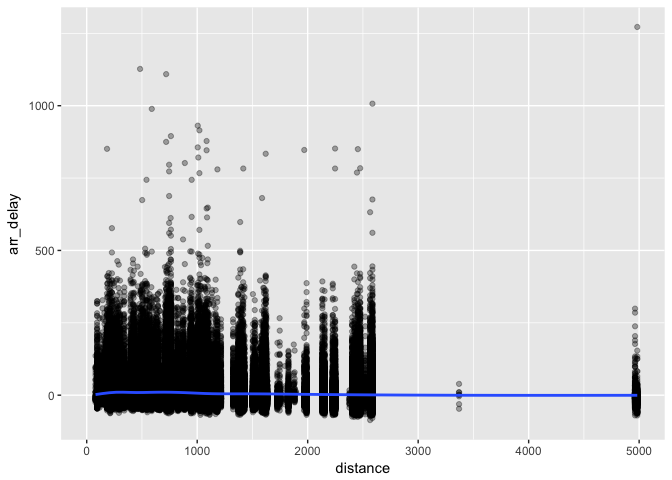
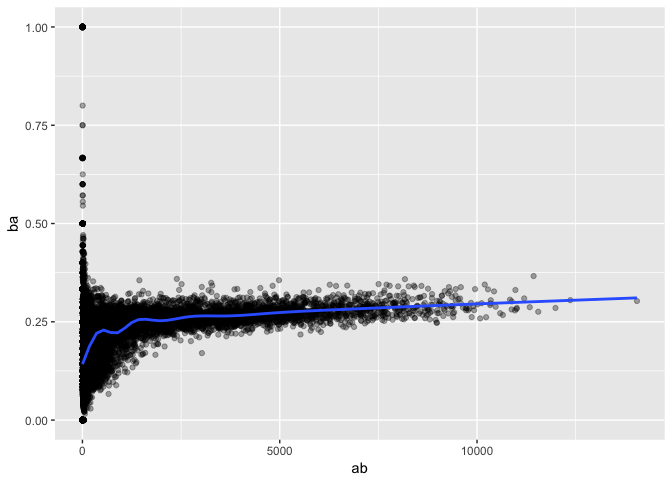
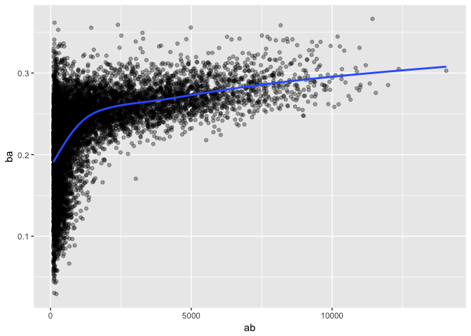
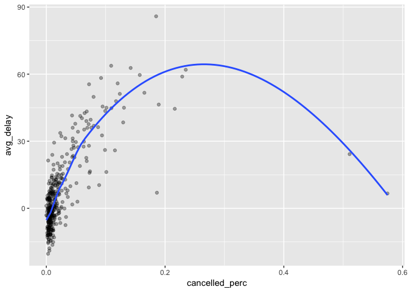
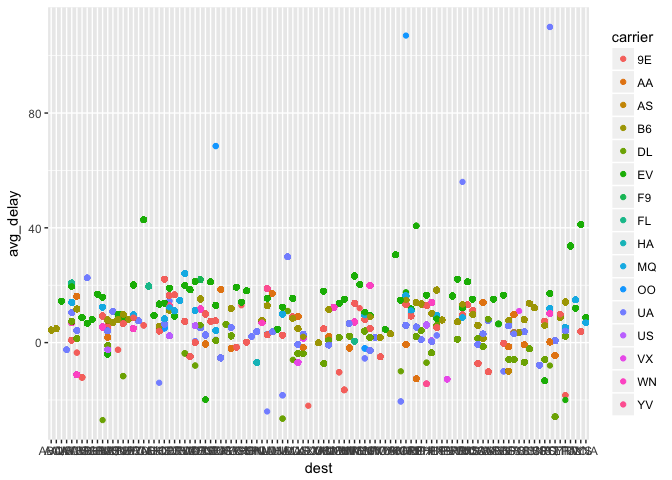
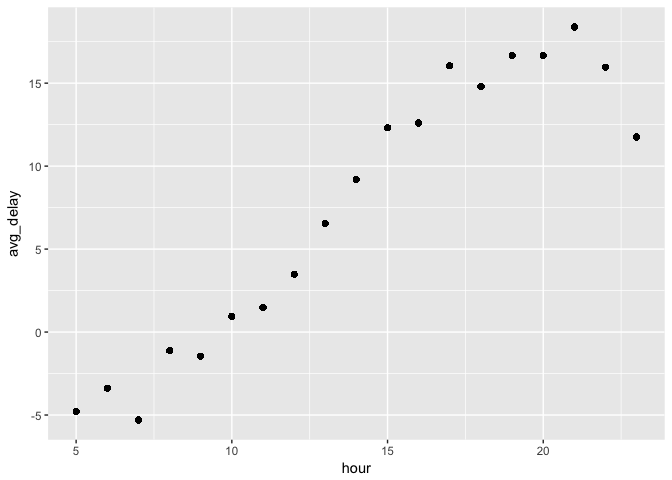
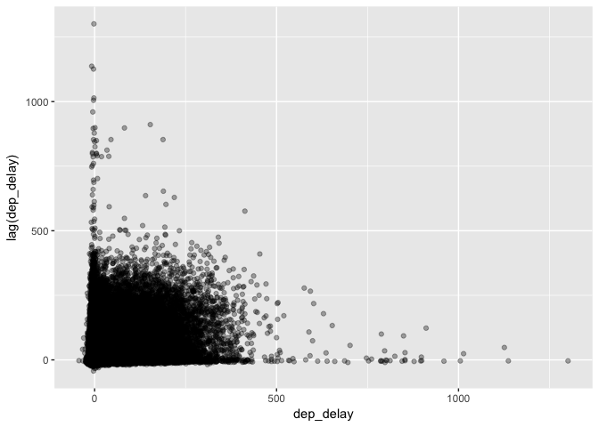

# May_17_HW
Rongkui Han  
May 16, 2017  

####5.6 Summarize()  

```r
library(tidyverse)
```

```
## Loading tidyverse: ggplot2
## Loading tidyverse: tibble
## Loading tidyverse: tidyr
## Loading tidyverse: readr
## Loading tidyverse: purrr
## Loading tidyverse: dplyr
```

```
## Conflicts with tidy packages ----------------------------------------------
```

```
## filter(): dplyr, stats
## lag():    dplyr, stats
```

```r
library(nycflights13)
summarise(flights, delay = mean(dep_delay, na.rm = TRUE))
```

```
## # A tibble: 1 × 1
##      delay
##      <dbl>
## 1 12.63907
```

```r
by_day = group_by(flights, year, month, day)
summarise(by_day, delay = mean(dep_delay, na.rm = TRUE))
```

```
## Source: local data frame [365 x 4]
## Groups: year, month [?]
## 
##     year month   day     delay
##    <int> <int> <int>     <dbl>
## 1   2013     1     1 11.548926
## 2   2013     1     2 13.858824
## 3   2013     1     3 10.987832
## 4   2013     1     4  8.951595
## 5   2013     1     5  5.732218
## 6   2013     1     6  7.148014
## 7   2013     1     7  5.417204
## 8   2013     1     8  2.553073
## 9   2013     1     9  2.276477
## 10  2013     1    10  2.844995
## # ... with 355 more rows
```

```r
#I like this. It will be very useful for analyzing my data. 
```

#####5.6.1 Combining multiple operations with the pipe  

```r
by_dest = group_by(flights, dest)
delay = summarise(by_dest, 
                  count = n(), #this counts the # of entries in each group. Might be useful. 
                  dist = mean(distance, na.rm = TRUE), 
                  delay = mean(arr_delay, na.rm = TRUE)
)
delay = filter(delay, count > 20, dest != "HNL")
ggplot(data = delay, mapping = aes(x = dist, y = delay)) +
  geom_point(aes(size = count), alpha = 1/3) +
  geom_smooth(se = FALSE)
```

```
## `geom_smooth()` using method = 'loess'
```

<!-- -->

I'm curious what the plot would look like without the grouping.  

```r
ggplot(data = flights, mapping = aes(x = distance, y = arr_delay)) +
  geom_point(alpha = 1/3) +
  geom_smooth(se = FALSE)
```

```
## `geom_smooth()` using method = 'gam'
```

```
## Warning: Removed 9430 rows containing non-finite values (stat_smooth).
```

```
## Warning: Removed 9430 rows containing missing values (geom_point).
```

<!-- -->

Oh.  

Using pipe "%>%": 

```r
delays <- flights %>% 
  group_by(dest) %>% 
  summarise(
    count = n(),
    dist = mean(distance, na.rm = TRUE),
    delay = mean(arr_delay, na.rm = TRUE)
  ) %>% 
  filter(count > 20, dest != "HNL")
```

#####5.6.3 Counts 
Whenever you do any aggregation, it's always a good idea to include either a count (n()) or a count of non-missing value (sum(!is.na(x))). 

```r
not_cancelled = flights %>%
  filter(!is.na(dep_delay), !is.na(arr_delay)) 
not_cancelled %>%
  group_by(year, month, day) %>%
  summarise(mean = mean(dep_delay))
```

```
## Source: local data frame [365 x 4]
## Groups: year, month [?]
## 
##     year month   day      mean
##    <int> <int> <int>     <dbl>
## 1   2013     1     1 11.435620
## 2   2013     1     2 13.677802
## 3   2013     1     3 10.907778
## 4   2013     1     4  8.965859
## 5   2013     1     5  5.732218
## 6   2013     1     6  7.145959
## 7   2013     1     7  5.417204
## 8   2013     1     8  2.558296
## 9   2013     1     9  2.301232
## 10  2013     1    10  2.844995
## # ... with 355 more rows
```

```r
delays = not_cancelled %>%  
  group_by(tailnum) %>%
  summarise(delay = mean(arr_delay))
ggplot(data = delays, mapping = aes(x = delay))+
  geom_freqpoly(binwidth = 10)
```

<!-- -->


```r
delays = not_cancelled %>%
  group_by(tailnum) %>%
  summarise(delay = mean(arr_delay, na.rm = TRUE), n = n())
ggplot(data = delays, mapping = aes(x = n, y = delay)) +
  geom_point(alpha = 1/10)
```

<!-- -->


```r
delays %>%
  filter(n>25) %>%
  ggplot(mapping = aes(x = n, y = delay)) +
  geom_point(alpha = 1/10)
```

<!-- -->

Battind example:  

```r
library(Lahman)
batting = as_tibble(Lahman::Batting)
batter = batting %>%
  group_by(playerID) %>%
  summarise(
    ba = sum(H, na.rm = TRUE)/sum(AB, na.rm = TRUE),
    ab = sum(AB, na.rm = TRUE)
  )
#comparing before and after filtering out the groups with too few data points:
batter %>%
  ggplot(mapping = aes(x = ab, y = ba)) +
    geom_point(alpha = 1/3) +
    geom_smooth(se = FALSE)
```

```
## `geom_smooth()` using method = 'gam'
```

```
## Warning: Removed 1955 rows containing non-finite values (stat_smooth).
```

```
## Warning: Removed 1955 rows containing missing values (geom_point).
```

<!-- -->

```r
batter %>%
  filter(ab > 100) %>%
  ggplot(mapping = aes(x = ab, y = ba)) +
    geom_point(alpha = 1/3) +
    geom_smooth(se = FALSE)
```

```
## `geom_smooth()` using method = 'gam'
```

<!-- -->
Measuring spread:  

```r
not_cancelled %>%
  group_by(year, month, day) %>%
  summarise(
    avg_delay1 = mean(arr_delay),
    avg_delay2 = mean(arr_delay[arr_delay > 0])
  )
```

```
## Source: local data frame [365 x 5]
## Groups: year, month [?]
## 
##     year month   day avg_delay1 avg_delay2
##    <int> <int> <int>      <dbl>      <dbl>
## 1   2013     1     1 12.6510229   32.48156
## 2   2013     1     2 12.6928879   32.02991
## 3   2013     1     3  5.7333333   27.66087
## 4   2013     1     4 -1.9328194   28.30976
## 5   2013     1     5 -1.5258020   22.55882
## 6   2013     1     6  4.2364294   24.37270
## 7   2013     1     7 -4.9473118   27.76132
## 8   2013     1     8 -3.2275785   20.78909
## 9   2013     1     9 -0.2642777   25.63415
## 10  2013     1    10 -5.8988159   27.34545
## # ... with 355 more rows
```


```r
not_cancelled %>%
  group_by(dest) %>%
  summarise(distance_sd = sd(distance)) %>%
  arrange(desc(distance_sd)) #Man I'm lovin' it. This looks super useful. 
```

```
## # A tibble: 104 × 2
##     dest distance_sd
##    <chr>       <dbl>
## 1    EGE   10.542765
## 2    SAN   10.350094
## 3    SFO   10.216017
## 4    HNL   10.004197
## 5    SEA    9.977993
## 6    LAS    9.907786
## 7    PDX    9.873299
## 8    PHX    9.862546
## 9    LAX    9.657195
## 10   IND    9.458066
## # ... with 94 more rows
```
Ranking:   

```r
not_cancelled %>%
  group_by(year, month, day) %>%
  summarise(
    first = min(dep_time),
    last = max(dep_time)
  )
```

```
## Source: local data frame [365 x 5]
## Groups: year, month [?]
## 
##     year month   day first  last
##    <int> <int> <int> <int> <int>
## 1   2013     1     1   517  2356
## 2   2013     1     2    42  2354
## 3   2013     1     3    32  2349
## 4   2013     1     4    25  2358
## 5   2013     1     5    14  2357
## 6   2013     1     6    16  2355
## 7   2013     1     7    49  2359
## 8   2013     1     8   454  2351
## 9   2013     1     9     2  2252
## 10  2013     1    10     3  2320
## # ... with 355 more rows
```

Measuring position:  

```r
not_cancelled %>%
  group_by(year, month, day) %>%
  summarise(
    first_dep = first(dep_time),
    last_dep = last(dep_time)
  )
```

```
## Source: local data frame [365 x 5]
## Groups: year, month [?]
## 
##     year month   day first_dep last_dep
##    <int> <int> <int>     <int>    <int>
## 1   2013     1     1       517     2356
## 2   2013     1     2        42     2354
## 3   2013     1     3        32     2349
## 4   2013     1     4        25     2358
## 5   2013     1     5        14     2357
## 6   2013     1     6        16     2355
## 7   2013     1     7        49     2359
## 8   2013     1     8       454     2351
## 9   2013     1     9         2     2252
## 10  2013     1    10         3     2320
## # ... with 355 more rows
```

first() and last() look the same as min() and max()... but that is just because within each group the data is organized by departure time. first(), nth() and last() are supposed to return the nth element within each group, regardless of the value. Let's see if arrange() can change the output.   


```r
not_cancelled %>%
  arrange(desc(dep_time)) %>%
  group_by(year, month, day) %>%
  summarise(
    last_dep2 = first(dep_time),
    last_eighth_dep2 = nth(dep_time,8)
  )
```

```
## Source: local data frame [365 x 5]
## Groups: year, month [?]
## 
##     year month   day last_dep2 last_eighth_dep2
##    <int> <int> <int>     <int>            <int>
## 1   2013     1     1      2356             2312
## 2   2013     1     2      2354             2303
## 3   2013     1     3      2349             2245
## 4   2013     1     4      2358             2249
## 5   2013     1     5      2357             2300
## 6   2013     1     6      2355             2251
## 7   2013     1     7      2359             2244
## 8   2013     1     8      2351             2239
## 9   2013     1     9      2252             2223
## 10  2013     1    10      2320             2230
## # ... with 355 more rows
```


```r
not_cancelled %>%
  group_by(year, month, day) %>%
  summarise(carriers = n_distinct(carrier)) %>%
  arrange(desc(carriers))
```

```
## Source: local data frame [365 x 4]
## Groups: year, month [12]
## 
##     year month   day carriers
##    <int> <int> <int>    <int>
## 1   2013     1    30       16
## 2   2013     8    27       16
## 3   2013     8    28       16
## 4   2013     8    29       16
## 5   2013     8    30       16
## 6   2013     9     3       16
## 7   2013     9     4       16
## 8   2013     9     5       16
## 9   2013     9     6       16
## 10  2013     9     8       16
## # ... with 355 more rows
```


```r
not_cancelled %>%
  count(dest)
```

```
## # A tibble: 104 × 2
##     dest     n
##    <chr> <int>
## 1    ABQ   254
## 2    ACK   264
## 3    ALB   418
## 4    ANC     8
## 5    ATL 16837
## 6    AUS  2411
## 7    AVL   261
## 8    BDL   412
## 9    BGR   358
## 10   BHM   269
## # ... with 94 more rows
```

```r
#how do you arrange this table by n then?
not_cancelled %>%
  group_by(dest) %>%
  summarise(n = n()) %>%
  arrange(desc(n)) #Yay figured it out!
```

```
## # A tibble: 104 × 2
##     dest     n
##    <chr> <int>
## 1    ATL 16837
## 2    ORD 16566
## 3    LAX 16026
## 4    BOS 15022
## 5    MCO 13967
## 6    CLT 13674
## 7    SFO 13173
## 8    FLL 11897
## 9    MIA 11593
## 10   DCA  9111
## # ... with 94 more rows
```

The "wt =" option in count() function is rather interesting. You can multiple each n (1) by the weight and get a sum total of a column within each group. For example:  

```r
weighted = not_cancelled %>%
  count(tailnum, wt = distance)
weighted %>%
  arrange(n) # Guess I just really like to arrange things. 
```

```
## # A tibble: 4,037 × 2
##    tailnum     n
##      <chr> <dbl>
## 1   N505SW   185
## 2   N746SK   229
## 3   N881AS   292
## 4   N824AS   296
## 5   N701SK   419
## 6   N702SK   419
## 7   N705SK   419
## 8   N710SK   419
## 9   N726SK   419
## 10  N740SK   419
## # ... with 4,027 more rows
```

```r
#Qrious: it looks like count() automatically generates a column named "n". Can you rename this column without a separate command?
```


```r
not_cancelled %>%
  group_by(year, month, day) %>%
  summarise(n_early = sum(dep_time,50)) %>%
  arrange(desc(n_early))
```

```
## Source: local data frame [365 x 4]
## Groups: year, month [12]
## 
##     year month   day n_early
##    <int> <int> <int>   <dbl>
## 1   2013     8     7 1351926
## 2   2013    12     2 1349050
## 3   2013    11    27 1345319
## 4   2013     7    24 1343919
## 5   2013     4    26 1342639
## 6   2013    11    22 1342331
## 7   2013     8     5 1342157
## 8   2013     8    15 1340549
## 9   2013     7    31 1339942
## 10  2013     7    25 1339867
## # ... with 355 more rows
```

```r
not_cancelled %>%
  group_by(year, month, day) %>%
  summarise(hour_perc = mean(arr_delay > 60)) # this mean(logical command) part is very interesting. it is calculating the mean of a bunch of 1's and 0,s. In other words, this is a fast way of calculating percentages. 
```

```
## Source: local data frame [365 x 4]
## Groups: year, month [?]
## 
##     year month   day  hour_perc
##    <int> <int> <int>      <dbl>
## 1   2013     1     1 0.07220217
## 2   2013     1     2 0.08512931
## 3   2013     1     3 0.05666667
## 4   2013     1     4 0.03964758
## 5   2013     1     5 0.03486750
## 6   2013     1     6 0.04704463
## 7   2013     1     7 0.03333333
## 8   2013     1     8 0.02130045
## 9   2013     1     9 0.02015677
## 10  2013     1    10 0.01829925
## # ... with 355 more rows
```

#####5.6.5  

```r
daily = group_by(flights, year, month, day)
dim(daily)
```

```
## [1] 336776     19
```

```r
dim(flights) # the two have no visible difference.
```

```
## [1] 336776     19
```

```r
(per_day = summarise(daily, flight.num = n()))
```

```
## Source: local data frame [365 x 4]
## Groups: year, month [?]
## 
##     year month   day flight.num
##    <int> <int> <int>      <int>
## 1   2013     1     1        842
## 2   2013     1     2        943
## 3   2013     1     3        914
## 4   2013     1     4        915
## 5   2013     1     5        720
## 6   2013     1     6        832
## 7   2013     1     7        933
## 8   2013     1     8        899
## 9   2013     1     9        902
## 10  2013     1    10        932
## # ... with 355 more rows
```

#####5.6.6 Ungrouping  

```r
daily %>%
  ungroup() %>%
  summarise(flight.num = n()) #Everything is in one big group now. 
```

```
## # A tibble: 1 × 1
##   flight.num
##        <int>
## 1     336776
```

#####5.6.7 Exercise  
######1.   

```r
##This scenario makes me think about accessing the spread of arrival time.
not_cancelled %>%
  group_by(tailnum) %>%
  summarise(
    avg_delay = mean(arr_delay, na.rm = TRUE), 
    spread_delay = sd(arr_delay, na.rm = TRUE), 
    perc_delay = mean(arr_delay > 0),
    avg_delay_when_delayed = mean(arr_delay[arr_delay > 0], na.rm = TRUE)
    )
```

```
## # A tibble: 4,037 × 5
##    tailnum  avg_delay spread_delay perc_delay avg_delay_when_delayed
##      <chr>      <dbl>        <dbl>      <dbl>                  <dbl>
## 1   D942DN 31.5000000     46.09049  0.7500000              45.666667
## 2   N0EGMQ  9.9829545     40.47890  0.4517045              37.088050
## 3   N10156 12.7172414     39.62387  0.5034483              39.328767
## 4   N102UW  2.9375000     43.93293  0.2916667              40.642857
## 5   N103US -6.9347826     12.10216  0.2826087               8.307692
## 6   N104UW  1.8043478     45.23254  0.2826087              45.692308
## 7   N10575 20.6914498     52.31640  0.4721190              58.362205
## 8   N105UW -0.2666667     30.57286  0.3555556              26.937500
## 9   N107US -5.7317073     23.61040  0.2439024              22.100000
## 10  N108UW -1.2500000     31.41608  0.3500000              27.190476
## # ... with 4,027 more rows
```

```r
# I'm out of ideas...
```

######2.  

```r
not_cancelled %>%
  count(dest)
```

```
## # A tibble: 104 × 2
##     dest     n
##    <chr> <int>
## 1    ABQ   254
## 2    ACK   264
## 3    ALB   418
## 4    ANC     8
## 5    ATL 16837
## 6    AUS  2411
## 7    AVL   261
## 8    BDL   412
## 9    BGR   358
## 10   BHM   269
## # ... with 94 more rows
```

```r
#Alternative:
not_cancelled %>%
  group_by(dest) %>%
  summarise(n = n())
```

```
## # A tibble: 104 × 2
##     dest     n
##    <chr> <int>
## 1    ABQ   254
## 2    ACK   264
## 3    ALB   418
## 4    ANC     8
## 5    ATL 16837
## 6    AUS  2411
## 7    AVL   261
## 8    BDL   412
## 9    BGR   358
## 10   BHM   269
## # ... with 94 more rows
```

```r
not_cancelled %>%
  count(tailnum, wt = distance)
```

```
## # A tibble: 4,037 × 2
##    tailnum      n
##      <chr>  <dbl>
## 1   D942DN   3418
## 2   N0EGMQ 239143
## 3   N10156 109664
## 4   N102UW  25722
## 5   N103US  24619
## 6   N104UW  24616
## 7   N10575 139903
## 8   N105UW  23618
## 9   N107US  21677
## 10  N108UW  32070
## # ... with 4,027 more rows
```

```r
#Alternative:
not_cancelled %>%
  group_by(tailnum) %>%
  summarise(total = sum(distance))
```

```
## # A tibble: 4,037 × 2
##    tailnum  total
##      <chr>  <dbl>
## 1   D942DN   3418
## 2   N0EGMQ 239143
## 3   N10156 109664
## 4   N102UW  25722
## 5   N103US  24619
## 6   N104UW  24616
## 7   N10575 139903
## 8   N105UW  23618
## 9   N107US  21677
## 10  N108UW  32070
## # ... with 4,027 more rows
```

######3.  

```r
# I guess it is most important tha air_time is NA?
not.cancelled = flights %>%
  filter(!is.na(air_time))
dim(not_cancelled)
```

```
## [1] 327346     19
```

```r
dim(not.cancelled)
```

```
## [1] 327346     19
```

```r
# nope i dont think this made a difference.
notcancelled = flights %>%
  filter(!is.na(dep_delay) | is.na(arr_delay))
dim(notcancelled)
```

```
## [1] 336776     19
```

```r
# maybe this what we were looking for?
```

######4.  

```r
q4 = flights %>%
  group_by(year, month, day) %>%
  summarise(
    cancelled_perc = mean(is.na(air_time)), 
    avg_delay = mean(arr_delay, na.rm = TRUE))
ggplot(q4, mapping = aes(x = cancelled_perc, y = avg_delay)) +
  geom_point(alpha = 1/3) +
  geom_smooth(se = FALSE)
```

```
## `geom_smooth()` using method = 'loess'
```

<!-- -->

Looks like there is a positive linear correlation between percentage of flight cancelled and average delay time when the percentage of flight cancelled is under 20%.  

######5.  

```r
worst_carrier = flights %>% 
  group_by(carrier, dest) %>% 
  mutate(n = n(), avg_delay = mean(arr_delay, na.rm = TRUE))
ggplot(worst_carrier, mapping = aes(x = dest, y = avg_delay)) +
  geom_point(aes(color = carrier))
```

```
## Warning: Removed 2 rows containing missing values (geom_point).
```

<!-- -->

######6.  

```r
flights %>%
  group_by(carrier) %>%
  count(dest = sort(dest))
```

```
## Source: local data frame [314 x 3]
## Groups: carrier [?]
## 
##    carrier  dest     n
##      <chr> <chr> <int>
## 1       9E   ATL    59
## 2       9E   AUS     2
## 3       9E   AVL    10
## 4       9E   BGR     1
## 5       9E   BNA   474
## 6       9E   BOS   914
## 7       9E   BTV     2
## 8       9E   BUF   833
## 9       9E   BWI   856
## 10      9E   CAE     3
## # ... with 304 more rows
```

Looks like the sort() argument splits each group further into subsets by a different category. I guess we can use this when we don't want to actually subset the large dataset into small subsets?  

####5.7 Grouped mutates and filters

```r
flights_sml <- select(flights, year:day, ends_with("delay"), distance, air_time)
flights_sml %>% 
  group_by(year, month, day) %>%
  filter(rank(desc(arr_delay)) < 10) #find out the top 10 delayed flight in each day
```

```
## Source: local data frame [3,306 x 7]
## Groups: year, month, day [365]
## 
##     year month   day dep_delay arr_delay distance air_time
##    <int> <int> <int>     <dbl>     <dbl>    <dbl>    <dbl>
## 1   2013     1     1       853       851      184       41
## 2   2013     1     1       290       338     1134      213
## 3   2013     1     1       260       263      266       46
## 4   2013     1     1       157       174      213       60
## 5   2013     1     1       216       222      708      121
## 6   2013     1     1       255       250      589      115
## 7   2013     1     1       285       246     1085      146
## 8   2013     1     1       192       191      199       44
## 9   2013     1     1       379       456     1092      222
## 10  2013     1     2       224       207      550       94
## # ... with 3,296 more rows
```

```r
popular_dests <- flights %>% 
  group_by(dest) %>% 
  filter(n() > 365)
popular_dests # find out groups above certain threshold
```

```
## Source: local data frame [332,577 x 19]
## Groups: dest [77]
## 
##     year month   day dep_time sched_dep_time dep_delay arr_time
##    <int> <int> <int>    <int>          <int>     <dbl>    <int>
## 1   2013     1     1      517            515         2      830
## 2   2013     1     1      533            529         4      850
## 3   2013     1     1      542            540         2      923
## 4   2013     1     1      544            545        -1     1004
## 5   2013     1     1      554            600        -6      812
## 6   2013     1     1      554            558        -4      740
## 7   2013     1     1      555            600        -5      913
## 8   2013     1     1      557            600        -3      709
## 9   2013     1     1      557            600        -3      838
## 10  2013     1     1      558            600        -2      753
## # ... with 332,567 more rows, and 12 more variables: sched_arr_time <int>,
## #   arr_delay <dbl>, carrier <chr>, flight <int>, tailnum <chr>,
## #   origin <chr>, dest <chr>, air_time <dbl>, distance <dbl>, hour <dbl>,
## #   minute <dbl>, time_hour <dttm>
```

```r
popular_dests %>% 
  filter(arr_delay > 0) %>% 
  mutate(prop_delay = arr_delay / sum(arr_delay)) %>% 
  select(year:day, dest, arr_delay, prop_delay) # this is kina weird... standardizing each entry to group mean. 
```

```
## Source: local data frame [131,106 x 6]
## Groups: dest [77]
## 
##     year month   day  dest arr_delay   prop_delay
##    <int> <int> <int> <chr>     <dbl>        <dbl>
## 1   2013     1     1   IAH        11 1.106740e-04
## 2   2013     1     1   IAH        20 2.012255e-04
## 3   2013     1     1   MIA        33 2.350026e-04
## 4   2013     1     1   ORD        12 4.239594e-05
## 5   2013     1     1   FLL        19 9.377853e-05
## 6   2013     1     1   ORD         8 2.826396e-05
## 7   2013     1     1   LAX         7 3.444441e-05
## 8   2013     1     1   DFW        31 2.817951e-04
## 9   2013     1     1   ATL        12 3.996017e-05
## 10  2013     1     1   DTW        16 1.157257e-04
## # ... with 131,096 more rows
```

#####5.7.1
######1. In general, you can use mutate() and filter () to generate statistics within each group, and statistics of each group in respect to the whole dataset. 

######2.I'm not sure if this is what the question is asking for... this is filtering for the most delayed flight for each tail number. 

```r
not_cancelled %>%
  group_by(tailnum) %>%
  mutate(avg_delay = mean(arr_delay, na.rm  = TRUE)) %>%
  filter(rank(desc(avg_delay)) < 5)
```

```
## Source: local data frame [2,032 x 20]
## Groups: tailnum [589]
## 
##     year month   day dep_time sched_dep_time dep_delay arr_time
##    <int> <int> <int>    <int>          <int>     <dbl>    <int>
## 1   2013     1     1      622            630        -8     1017
## 2   2013     1     1      629            630        -1      824
## 3   2013     1     1      724            725        -1     1020
## 4   2013     1     1     1029           1030        -1     1427
## 5   2013     1     1     1059           1100        -1     1201
## 6   2013     1     1     1356           1350         6     1659
## 7   2013     1     1     1825           1829        -4     2046
## 8   2013     1     1     2058           2100        -2     2235
## 9   2013     1     2      626            630        -4      850
## 10  2013     1     2      629            630        -1     1010
## # ... with 2,022 more rows, and 13 more variables: sched_arr_time <int>,
## #   arr_delay <dbl>, carrier <chr>, flight <int>, tailnum <chr>,
## #   origin <chr>, dest <chr>, air_time <dbl>, distance <dbl>, hour <dbl>,
## #   minute <dbl>, time_hour <dttm>, avg_delay <dbl>
```

######3.  

```r
booking = not_cancelled %>%
  group_by(hour) %>%
  mutate(avg_delay = mean(arr_delay, na.rm = TRUE)) %>%
  arrange(avg_delay)
ggplot(booking, mapping = aes(x = hour, y = avg_delay)) +
  geom_point()
```

<!-- -->

I should leave between 5am and 8am if I want to avoid delay.  

######4.  

```r
not_cancelled %>%
  group_by(dest) %>%
  transmute(total_delay = sum(arr_delay), prop_delay = arr_delay / total_delay)
```

```
## Adding missing grouping variables: `dest`
```

```
## Source: local data frame [327,346 x 3]
## Groups: dest [104]
## 
##     dest total_delay    prop_delay
##    <chr>       <dbl>         <dbl>
## 1    IAH       30046  3.661053e-04
## 2    IAH       30046  6.656460e-04
## 3    MIA        3467  9.518316e-03
## 4    BQN        7322 -2.458345e-03
## 5    ATL      190260 -1.313991e-04
## 6    ORD       97352  1.232640e-04
## 7    FLL       96153  1.976017e-04
## 8    IAD       74631 -1.875896e-04
## 9    MCO       76185 -1.050075e-04
## 10   ORD       97352  8.217602e-05
## # ... with 327,336 more rows
```

######5.  

```r
dep_ranked = not_cancelled %>%
  group_by(year, month, day) %>%
  mutate(dep_rank = rank(dep_time)) %>%
  arrange(year, month, day, dep_rank)

ggplot(dep_ranked, mapping = aes(x = dep_delay, y = lag(dep_delay))) + 
  geom_point(alpha = 1/3)
```

```
## Warning: Removed 1 rows containing missing values (geom_point).
```

<!-- -->

There is not an obvious linear relationship. 

######6.  

```r
not_cancelled %>%
  ungroup() %>%
  group_by(dest) %>%
  mutate(mean_air_time = mean(air_time, na.rm = TRUE), perc_air_time = air_time/mean_air_time) %>%
  arrange(perc_air_time)
```

```
## Source: local data frame [327,346 x 21]
## Groups: dest [104]
## 
##     year month   day dep_time sched_dep_time dep_delay arr_time
##    <int> <int> <int>    <int>          <int>     <dbl>    <int>
## 1   2013     3     2     1450           1500       -10     1547
## 2   2013     5    25     1709           1700         9     1923
## 3   2013     5    13     2040           2025        15     2225
## 4   2013     1    25     1954           2000        -6     2131
## 5   2013     3    23     1914           1910         4     2045
## 6   2013     7     2     1558           1513        45     1745
## 7   2013     2     3     2153           2129        24     2247
## 8   2013     2    12     2123           2130        -7     2211
## 9   2013     3     8     2026           1935        51     2131
## 10  2013     9    29     1359           1343        16     1523
## # ... with 327,336 more rows, and 14 more variables: sched_arr_time <int>,
## #   arr_delay <dbl>, carrier <chr>, flight <int>, tailnum <chr>,
## #   origin <chr>, dest <chr>, air_time <dbl>, distance <dbl>, hour <dbl>,
## #   minute <dbl>, time_hour <dttm>, mean_air_time <dbl>,
## #   perc_air_time <dbl>
```

######7.  

```r
not_cancelled %>%
  group_by(dest) %>%
  count(carrier) %>%
  summarise(num.carrier = n()) %>% # i dont know why this worked. 
  filter(num.carrier > 2)
```

```
## # A tibble: 52 × 2
##     dest num.carrier
##    <chr>       <int>
## 1    ATL           7
## 2    AUS           6
## 3    BNA           5
## 4    BOS           7
## 5    BTV           3
## 6    BUF           4
## 7    BWI           4
## 8    CHS           4
## 9    CLE           5
## 10   CLT           7
## # ... with 42 more rows
```


######8.  

```r
not_cancelled %>%
  group_by(tailnum) %>%
  summarise(n = n())
```

```
## # A tibble: 4,037 × 2
##    tailnum     n
##      <chr> <int>
## 1   D942DN     4
## 2   N0EGMQ   352
## 3   N10156   145
## 4   N102UW    48
## 5   N103US    46
## 6   N104UW    46
## 7   N10575   269
## 8   N105UW    45
## 9   N107US    41
## 10  N108UW    60
## # ... with 4,027 more rows
```

```r
not_cancelled %>%
  group_by(tailnum) %>%
  arrange(tailnum, year, month, day, hour, minute) %>%
  filter(arr_delay <= 1) %>%
  summarise(n = n())
```

```
## # A tibble: 3,936 × 2
##    tailnum     n
##      <chr> <int>
## 1   D942DN     1
## 2   N0EGMQ   200
## 3   N10156    72
## 4   N102UW    34
## 5   N103US    34
## 6   N104UW    34
## 7   N10575   144
## 8   N105UW    31
## 9   N107US    31
## 10  N108UW    40
## # ... with 3,926 more rows
```

