# R_club_HW5
Rongkui Han  
May 24, 2017  
####7.1.1 Prerequisites   

```r
library(tidyverse)
```

```
## Loading tidyverse: ggplot2
## Loading tidyverse: tibble
## Loading tidyverse: tidyr
## Loading tidyverse: readr
## Loading tidyverse: purrr
## Loading tidyverse: dplyr
```

```
## Conflicts with tidy packages ----------------------------------------------
```

```
## filter(): dplyr, stats
## lag():    dplyr, stats
```

####7.3 Variation  
#####7.3.1 Visualising distributions  

```r
ggplot(data = diamonds) +
  geom_bar(mapping = aes(x = cut))
```

<!-- -->

```r
diamonds %>%
  count(cut)
```

```
## # A tibble: 5 x 2
##         cut     n
##       <ord> <int>
## 1      Fair  1610
## 2      Good  4906
## 3 Very Good 12082
## 4   Premium 13791
## 5     Ideal 21551
```

```r
ggplot(data = diamonds) +
  geom_histogram(mapping= aes(x = carat), binwidth = 0.5)
```

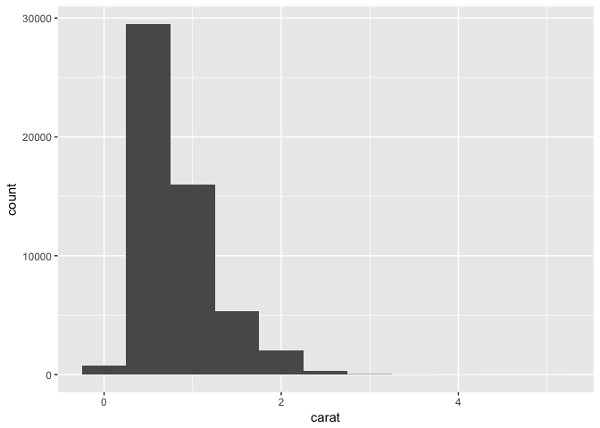<!-- -->

```r
diamonds %>%
  count(cut_width(carat,0.5))
```

```
## # A tibble: 11 x 2
##    `cut_width(carat, 0.5)`     n
##                     <fctr> <int>
##  1            [-0.25,0.25]   785
##  2             (0.25,0.75] 29498
##  3             (0.75,1.25] 15977
##  4             (1.25,1.75]  5313
##  5             (1.75,2.25]  2002
##  6             (2.25,2.75]   322
##  7             (2.75,3.25]    32
##  8             (3.25,3.75]     5
##  9             (3.75,4.25]     4
## 10             (4.25,4.75]     1
## 11             (4.75,5.25]     1
```

```r
smaller = diamonds %>%
  filter(carat < 3)
ggplot(data = smaller, mapping = aes(x = carat)) +
  geom_histogram(binwidth = 0.1)
```

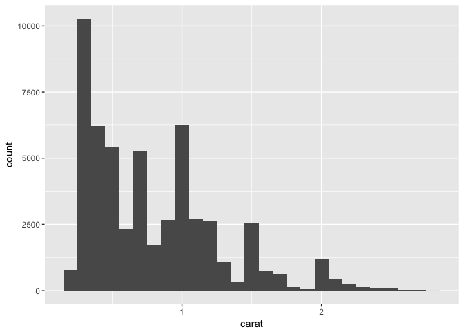<!-- -->

To overlay multiple histogram-type grams, we can use geom_freqpoly():

```r
ggplot(data = smaller, mapping = aes(x = carat, colour = cut)) +
  geom_freqpoly(binwidth = 0.1)
```

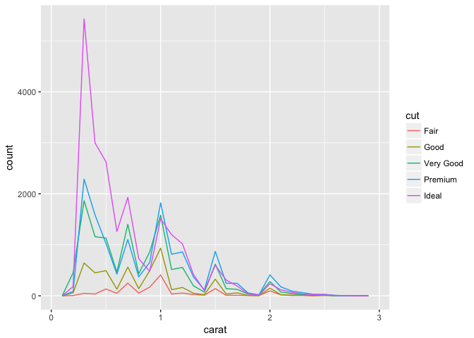<!-- -->

```r
#let's try something else:
ggplot(data = smaller, mapping  = aes(x = carat)) +
  geom_freqpoly(binwidth = 0.5, linetype = 02) +
  geom_freqpoly(binwidth = 0.1) #interesting...
```

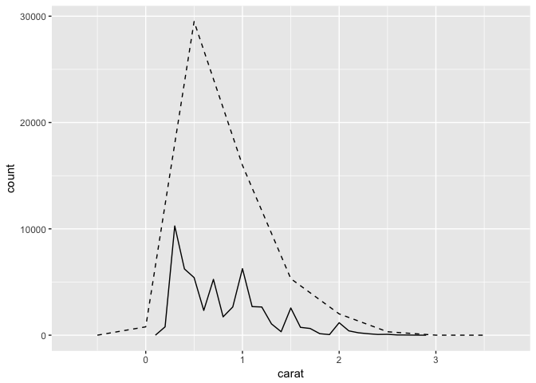<!-- -->

#####7.3.2 Typical values  

```r
ggplot(data = smaller, mapping= aes(x = carat, fill = cut)) +
  geom_bar(binwidth = 0.01) #added colors to make it more pleasing to the eyes...
```

```
## Warning: `geom_bar()` no longer has a `binwidth` parameter. Please use
## `geom_histogram()` instead.
```

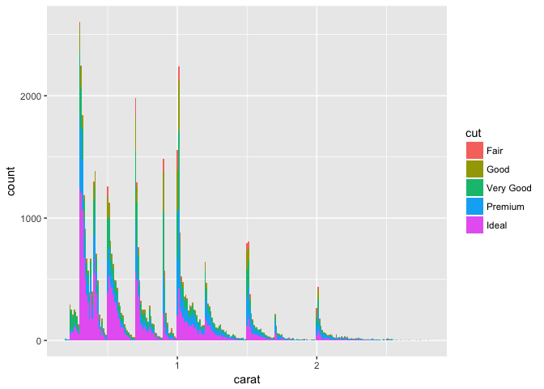<!-- -->


```r
ggplot(data = faithful, mapping = aes(x = eruptions)) +
  geom_histogram(binwidth = 0.25)
```

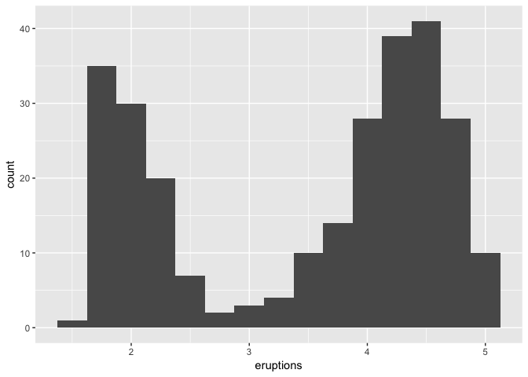<!-- -->


```r
ggplot(diamonds) +
  geom_histogram(mapping = aes(x = y), binwidth = 0.5)
```

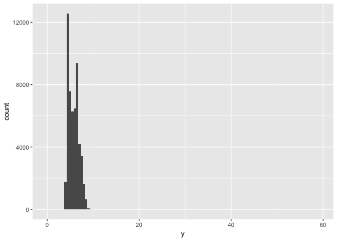<!-- -->

```r
ggplot(diamonds) +
  geom_histogram(mapping = aes(x = y), binwidth = 0.5) +
  coord_cartesian(ylim = c(0,50))
```

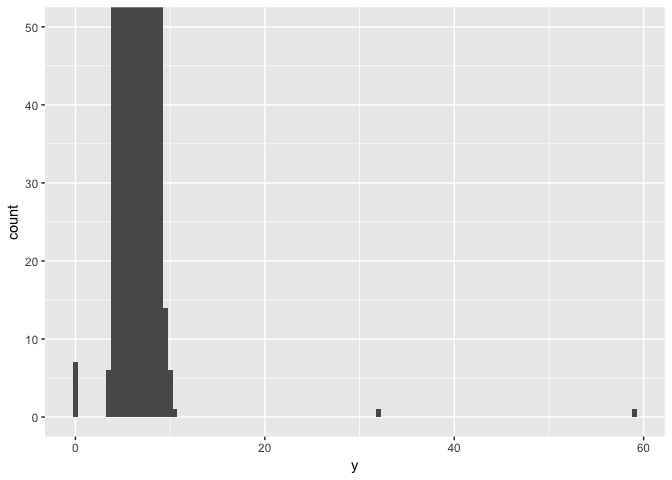<!-- -->

```r
unusual = diamonds %>%
  filter(y<3 | y>20) %>%
  select(price, x,y,z) %>%
  arrange(y)
unusual
```

```
## # A tibble: 9 x 4
##   price     x     y     z
##   <int> <dbl> <dbl> <dbl>
## 1  5139  0.00   0.0  0.00
## 2  6381  0.00   0.0  0.00
## 3 12800  0.00   0.0  0.00
## 4 15686  0.00   0.0  0.00
## 5 18034  0.00   0.0  0.00
## 6  2130  0.00   0.0  0.00
## 7  2130  0.00   0.0  0.00
## 8  2075  5.15  31.8  5.12
## 9 12210  8.09  58.9  8.06
```

#####7.3.4 Exercise  
1. Explore the distribution of each of the x, y, and z variables in diamonds. What do you learn? Think about a diamond and how you might decide which dimension is the length, width, and depth.  

```r
ggplot(data = diamonds, mapping = aes(x=x)) +
  geom_bar(binwidth = 0.25)
```

```
## Warning: `geom_bar()` no longer has a `binwidth` parameter. Please use
## `geom_histogram()` instead.
```

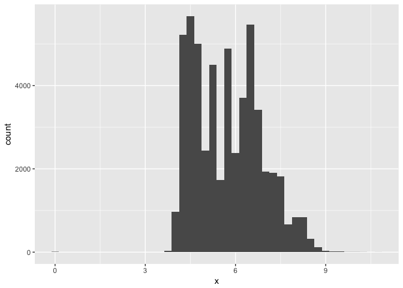<!-- -->

```r
ggplot(data = diamonds, mapping = aes(x=y)) +
  geom_bar(binwidth = 0.25)
```

```
## Warning: `geom_bar()` no longer has a `binwidth` parameter. Please use
## `geom_histogram()` instead.
```

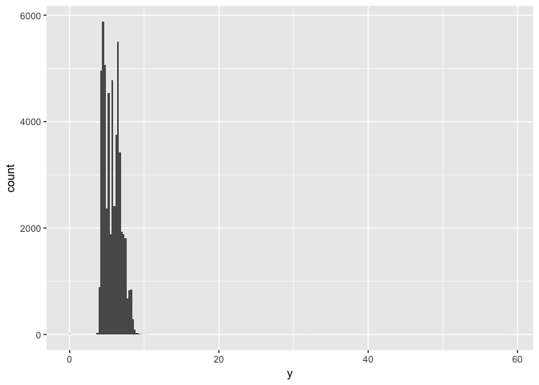<!-- -->

```r
usual.y = diamonds %>%
  filter(y<20 & y>3)
ggplot(data = usual.y, mapping = aes(x=y)) +
  geom_bar(binwidth = 0.25)
```

```
## Warning: `geom_bar()` no longer has a `binwidth` parameter. Please use
## `geom_histogram()` instead.
```

<!-- -->

```r
ggplot(data = diamonds, mapping = aes(x=z)) +
  geom_bar(binwidth = 0.25)
```

```
## Warning: `geom_bar()` no longer has a `binwidth` parameter. Please use
## `geom_histogram()` instead.
```

<!-- -->

```r
ggplot(data = diamonds, mapping = aes(x=z)) +
  geom_bar(binwidth = 0.25) +
  coord_cartesian(ylim = c(0,50))
```

```
## Warning: `geom_bar()` no longer has a `binwidth` parameter. Please use
## `geom_histogram()` instead.
```

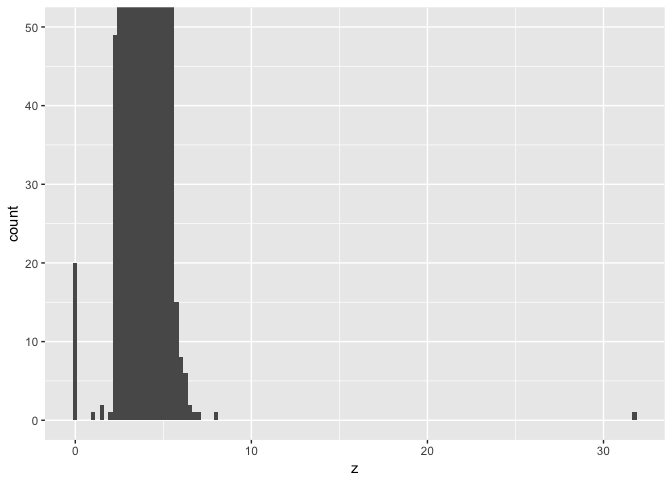<!-- -->

```r
unusual.z = diamonds %>%
  filter(z<1 | z>10) %>%
  select(price, x,y,z)
unusual.z
```

```
## # A tibble: 21 x 4
##    price     x     y     z
##    <int> <dbl> <dbl> <dbl>
##  1  3142  6.55  6.48     0
##  2  3167  6.66  6.60     0
##  3  3696  6.50  6.47     0
##  4  3837  6.50  6.47     0
##  5  4731  7.15  7.04     0
##  6  4954  0.00  6.62     0
##  7  5139  0.00  0.00     0
##  8  5564  6.88  6.83     0
##  9  6381  0.00  0.00     0
## 10 12631  8.49  8.45     0
## # ... with 11 more rows
```

```r
usual.z = diamonds %>%
  filter(z>1 & z<10)
ggplot(data = usual.z, mapping = aes(x=z)) +
  geom_bar(binwidth = 0.1)
```

```
## Warning: `geom_bar()` no longer has a `binwidth` parameter. Please use
## `geom_histogram()` instead.
```

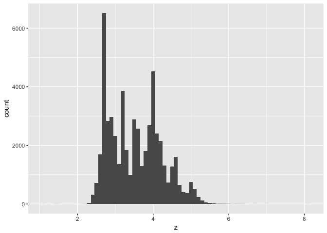<!-- -->

They all have an interesting almost bi-model distribution.   

2. Explore the distribution of price. Do you discover anything unusual or surprising? (Hint: Carefully think about the binwidth and make sure you try a wide range of values.)  

```r
ggplot(data = diamonds, mapping = aes(x = price)) +
  geom_histogram(binwidth = 500)
```

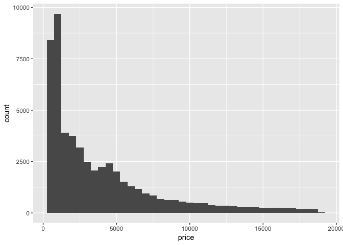<!-- -->

```r
ggplot(data = diamonds, mapping = aes(x = price)) +
  geom_histogram(binwidth = 100) #There is a weird gap around $1500
```

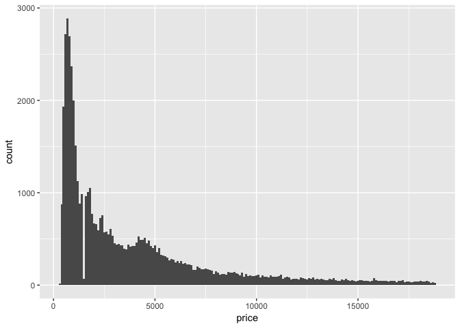<!-- -->

```r
ggplot(data = diamonds, mapping = aes(x = price)) +
  geom_histogram(binwidth = 10) #Yep there is a weird gap. 
```

<!-- -->

3. How many diamonds are 0.99 carat? How many are 1 carat? What do you think is the cause of the difference?  

```r
diamonds %>%
  count(carat == 0.99)
```

```
## # A tibble: 2 x 2
##   `carat == 0.99`     n
##             <lgl> <int>
## 1           FALSE 53917
## 2            TRUE    23
```

```r
diamonds %>%
  count(carat ==1.00)
```

```
## # A tibble: 2 x 2
##   `carat == 1`     n
##          <lgl> <int>
## 1        FALSE 52382
## 2         TRUE  1558
```

Only 23 diamonds in this dataset weigh 0.99 carat, but more than 1500 diamonds are exactly 1.00 carat. I think people have a strong preference/there is a big demand for 1.00 carat diamonds.   

4. Compare and contrast coord_cartesian() vs xlim() or ylim() when zooming in on a histogram. What happens if you leave binwidth unset? What happens if you try and zoom so only half a bar shows?  

```r
ggplot(data = diamonds, mapping = aes(x = price)) +
  geom_histogram(binwidth = 10) +
  coord_cartesian(xlim = c(1000,2000))
```

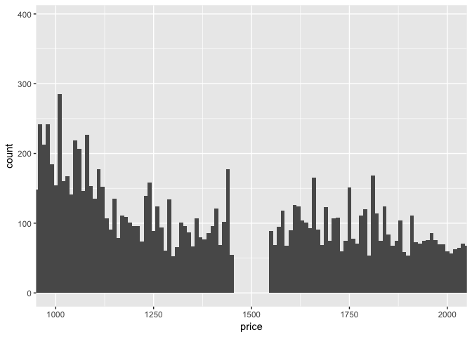<!-- -->

```r
ggplot(data = diamonds, mapping = aes(x = price), xlim = c(1000,2000)) +
  geom_histogram(binwidth = 10) #I have no idea what this xlim did. 
```

<!-- -->

```r
ggplot(data = diamonds, mapping = aes(x = price), xlim = c(1000,2000)) +
  geom_histogram() #The default bin width is a weird 625
```

```
## `stat_bin()` using `bins = 30`. Pick better value with `binwidth`.
```

<!-- -->

```r
ggplot(data = diamonds, mapping = aes(x = price), ylim = c(0,100)) +
  geom_histogram(binwidth = 10) #again it didn't do nothing...
```

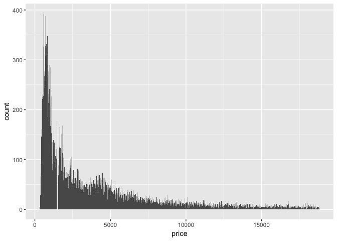<!-- -->

```r
ggplot(data = diamonds, mapping = aes(x = price), ylim = c(0,100)) +
  geom_histogram() #bin width = 30
```

```
## `stat_bin()` using `bins = 30`. Pick better value with `binwidth`.
```

<!-- -->


