# R_club_HW5
Rongkui Han  
May 24, 2017  
####7.1.1 Prerequisites   

```r
library(tidyverse)
```

```
## Loading tidyverse: ggplot2
## Loading tidyverse: tibble
## Loading tidyverse: tidyr
## Loading tidyverse: readr
## Loading tidyverse: purrr
## Loading tidyverse: dplyr
```

```
## Conflicts with tidy packages ----------------------------------------------
```

```
## filter(): dplyr, stats
## lag():    dplyr, stats
```

####7.3 Variation  
#####7.3.1 Visualising distributions  

```r
ggplot(data = diamonds) +
  geom_bar(mapping = aes(x = cut))
```

<!-- -->

```r
diamonds %>%
  count(cut)
```

```
## # A tibble: 5 x 2
##         cut     n
##       <ord> <int>
## 1      Fair  1610
## 2      Good  4906
## 3 Very Good 12082
## 4   Premium 13791
## 5     Ideal 21551
```

```r
ggplot(data = diamonds) +
  geom_histogram(mapping= aes(x = carat), binwidth = 0.5)
```

<!-- -->

```r
diamonds %>%
  count(cut_width(carat,0.5))
```

```
## # A tibble: 11 x 2
##    `cut_width(carat, 0.5)`     n
##                     <fctr> <int>
##  1            [-0.25,0.25]   785
##  2             (0.25,0.75] 29498
##  3             (0.75,1.25] 15977
##  4             (1.25,1.75]  5313
##  5             (1.75,2.25]  2002
##  6             (2.25,2.75]   322
##  7             (2.75,3.25]    32
##  8             (3.25,3.75]     5
##  9             (3.75,4.25]     4
## 10             (4.25,4.75]     1
## 11             (4.75,5.25]     1
```

```r
smaller = diamonds %>%
  filter(carat < 3)
ggplot(data = smaller, mapping = aes(x = carat)) +
  geom_histogram(binwidth = 0.1)
```

<!-- -->

To overlay multiple histogram-type grams, we can use geom_freqpoly():

```r
ggplot(data = smaller, mapping = aes(x = carat, colour = cut)) +
  geom_freqpoly(binwidth = 0.1)
```

<!-- -->

```r
#let's try something else:
ggplot(data = smaller, mapping  = aes(x = carat)) +
  geom_freqpoly(binwidth = 0.5, linetype = 02) +
  geom_freqpoly(binwidth = 0.1) #interesting...
```

<!-- -->

#####7.3.2 Typical values  

```r
ggplot(data = smaller, mapping= aes(x = carat, fill = cut)) +
  geom_bar(binwidth = 0.01) #added colors to make it more pleasing to the eyes...
```

```
## Warning: `geom_bar()` no longer has a `binwidth` parameter. Please use
## `geom_histogram()` instead.
```

<!-- -->


```r
ggplot(data = faithful, mapping = aes(x = eruptions)) +
  geom_histogram(binwidth = 0.25)
```

<!-- -->


```r
ggplot(diamonds) +
  geom_histogram(mapping = aes(x = y), binwidth = 0.5)
```

<!-- -->

```r
ggplot(diamonds) +
  geom_histogram(mapping = aes(x = y), binwidth = 0.5) +
  coord_cartesian(ylim = c(0,50))
```

<!-- -->

```r
unusual = diamonds %>%
  filter(y<3 | y>20) %>%
  select(price, x,y,z) %>%
  arrange(y)
unusual
```

```
## # A tibble: 9 x 4
##   price     x     y     z
##   <int> <dbl> <dbl> <dbl>
## 1  5139  0.00   0.0  0.00
## 2  6381  0.00   0.0  0.00
## 3 12800  0.00   0.0  0.00
## 4 15686  0.00   0.0  0.00
## 5 18034  0.00   0.0  0.00
## 6  2130  0.00   0.0  0.00
## 7  2130  0.00   0.0  0.00
## 8  2075  5.15  31.8  5.12
## 9 12210  8.09  58.9  8.06
```

#####7.3.4 Exercise  
1. Explore the distribution of each of the x, y, and z variables in diamonds. What do you learn? Think about a diamond and how you might decide which dimension is the length, width, and depth.  

```r
ggplot(data = diamonds, mapping = aes(x=x)) +
  geom_bar(binwidth = 0.25)
```

```
## Warning: `geom_bar()` no longer has a `binwidth` parameter. Please use
## `geom_histogram()` instead.
```

<!-- -->

```r
ggplot(data = diamonds, mapping = aes(x=y)) +
  geom_bar(binwidth = 0.25)
```

```
## Warning: `geom_bar()` no longer has a `binwidth` parameter. Please use
## `geom_histogram()` instead.
```

<!-- -->

```r
usual.y = diamonds %>%
  filter(y<20 & y>3)
ggplot(data = usual.y, mapping = aes(x=y)) +
  geom_bar(binwidth = 0.25)
```

```
## Warning: `geom_bar()` no longer has a `binwidth` parameter. Please use
## `geom_histogram()` instead.
```

<!-- -->

```r
ggplot(data = diamonds, mapping = aes(x=z)) +
  geom_bar(binwidth = 0.25)
```

```
## Warning: `geom_bar()` no longer has a `binwidth` parameter. Please use
## `geom_histogram()` instead.
```

<!-- -->

```r
ggplot(data = diamonds, mapping = aes(x=z)) +
  geom_bar(binwidth = 0.25) +
  coord_cartesian(ylim = c(0,50))
```

```
## Warning: `geom_bar()` no longer has a `binwidth` parameter. Please use
## `geom_histogram()` instead.
```

<!-- -->

```r
unusual.z = diamonds %>%
  filter(z<1 | z>10) %>%
  select(price, x,y,z)
unusual.z
```

```
## # A tibble: 21 x 4
##    price     x     y     z
##    <int> <dbl> <dbl> <dbl>
##  1  3142  6.55  6.48     0
##  2  3167  6.66  6.60     0
##  3  3696  6.50  6.47     0
##  4  3837  6.50  6.47     0
##  5  4731  7.15  7.04     0
##  6  4954  0.00  6.62     0
##  7  5139  0.00  0.00     0
##  8  5564  6.88  6.83     0
##  9  6381  0.00  0.00     0
## 10 12631  8.49  8.45     0
## # ... with 11 more rows
```

```r
usual.z = diamonds %>%
  filter(z>1 & z<10)
ggplot(data = usual.z, mapping = aes(x=z)) +
  geom_bar(binwidth = 0.1)
```

```
## Warning: `geom_bar()` no longer has a `binwidth` parameter. Please use
## `geom_histogram()` instead.
```

<!-- -->

They all have an interesting almost bi-model distribution.   

2. Explore the distribution of price. Do you discover anything unusual or surprising? (Hint: Carefully think about the binwidth and make sure you try a wide range of values.)  

```r
ggplot(data = diamonds, mapping = aes(x = price)) +
  geom_histogram(binwidth = 500)
```

<!-- -->

```r
ggplot(data = diamonds, mapping = aes(x = price)) +
  geom_histogram(binwidth = 100) #There is a weird gap around $1500
```

<!-- -->

```r
ggplot(data = diamonds, mapping = aes(x = price)) +
  geom_histogram(binwidth = 10) #Yep there is a weird gap. 
```

<!-- -->

3. How many diamonds are 0.99 carat? How many are 1 carat? What do you think is the cause of the difference?  

```r
diamonds %>%
  count(carat == 0.99)
```

```
## # A tibble: 2 x 2
##   `carat == 0.99`     n
##             <lgl> <int>
## 1           FALSE 53917
## 2            TRUE    23
```

```r
diamonds %>%
  count(carat ==1.00)
```

```
## # A tibble: 2 x 2
##   `carat == 1`     n
##          <lgl> <int>
## 1        FALSE 52382
## 2         TRUE  1558
```

Only 23 diamonds in this dataset weigh 0.99 carat, but more than 1500 diamonds are exactly 1.00 carat. I think people have a strong preference/there is a big demand for 1.00 carat diamonds.   

4. Compare and contrast coord_cartesian() vs xlim() or ylim() when zooming in on a histogram. What happens if you leave binwidth unset? What happens if you try and zoom so only half a bar shows?  

```r
ggplot(data = diamonds, mapping = aes(x = price)) +
  geom_histogram(binwidth = 10) +
  coord_cartesian(xlim = c(1000,2000))
```

<!-- -->

```r
ggplot(data = diamonds, mapping = aes(x = price), xlim = c(1000,2000)) +
  geom_histogram(binwidth = 10) #I have no idea what this xlim did. 
```

<!-- -->

```r
ggplot(data = diamonds, mapping = aes(x = price), xlim = c(1000,2000)) +
  geom_histogram() #The default bin width is a weird 625
```

```
## `stat_bin()` using `bins = 30`. Pick better value with `binwidth`.
```

<!-- -->

```r
ggplot(data = diamonds, mapping = aes(x = price), ylim = c(0,100)) +
  geom_histogram(binwidth = 10) #again it didn't do nothing...
```

<!-- -->

```r
ggplot(data = diamonds, mapping = aes(x = price), ylim = c(0,100)) +
  geom_histogram() #bin width = 30
```

```
## `stat_bin()` using `bins = 30`. Pick better value with `binwidth`.
```

<!-- -->

I don't understand what it means by "only half a bar shows".

####7.4 Missing values  
Bad example: this is example of bad filtering that might leave you with no data points to work with:  

```r
diamonds2 = diamonds %>%
  filter(between(y,3,20))
```

Good example:  

```r
diamonds2 = diamonds %>%
  mutate(y = ifelse( y < 3 | y > 20, NA, y)) # basically changes y value to NA if y is lower than 3 or bigger than 20.
ggplot(data = diamonds2, mapping = aes(x = x, y = y)) +
  geom_point()
```

```
## Warning: Removed 9 rows containing missing values (geom_point).
```

<!-- -->

```r
ggplot(data = diamonds2, mapping = aes(x = x, y = y)) +
  geom_point(na.rm = TRUE)
```

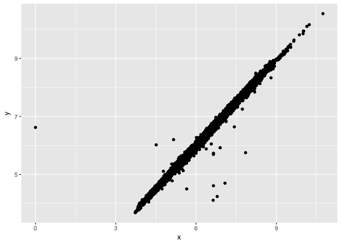<!-- -->


```r
library(nycflights13)
flights %>%
  mutate(
    cancelled = is.na(dep_time),
    sched_hour = sched_dep_time %/% 100,
    sched_min = sched_dep_time %% 100,
    sched_dep_time = sched_hour + sched_min / 60
  ) %>%
  ggplot(mapping = aes(sched_dep_time)) + 
    geom_freqpoly(mapping = aes(colour = cancelled), binwidth = 1/4)
```

<!-- -->

#####7.4.1 Exercise
1. What happens to missing values in a histogram? What happens to missing values in a bar chart? Why is there a difference?

```r
ggplot(data = diamonds2, mapping = aes(x = x)) +
  geom_bar()
```

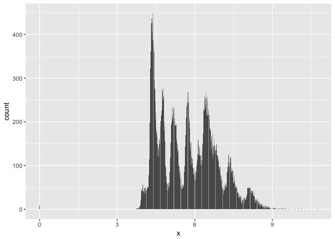<!-- -->

```r
ggplot(data = diamonds2, mapping = aes(x = x)) +
  geom_histogram()
```

```
## `stat_bin()` using `bins = 30`. Pick better value with `binwidth`.
```

<!-- -->

I don't think I understand how to check the questions. fromt he documentation it looks likt the deault setting for both functions are na.rm = FALSE.

2. What does na.rm = TRUE do in mean() and sum()?

```r
summarise(diamonds, mean.x = mean(x))
```

```
## # A tibble: 1 x 1
##     mean.x
##      <dbl>
## 1 5.731157
```

```r
summarise(diamonds, mean.x = mean(x, na.rm = TRUE))
```

```
## # A tibble: 1 x 1
##     mean.x
##      <dbl>
## 1 5.731157
```

```r
summarise(diamonds, sum.x = sum(x))
```

```
## # A tibble: 1 x 1
##      sum.x
##      <dbl>
## 1 309138.6
```

```r
summarise(diamonds, sum.x = sum(x, na.rm = TRUE))
```

```
## # A tibble: 1 x 1
##      sum.x
##      <dbl>
## 1 309138.6
```

```r
#somehow I remember the na.rm argument made a difference in the last homework, but they did not make any differnce in this homework...
```

####7.5 Covariance  
#####7.5.1 Categorical and continuous variables  

```r
diamonds
```

```
## # A tibble: 53,940 x 10
##    carat       cut color clarity depth table price     x     y     z
##    <dbl>     <ord> <ord>   <ord> <dbl> <dbl> <int> <dbl> <dbl> <dbl>
##  1  0.23     Ideal     E     SI2  61.5    55   326  3.95  3.98  2.43
##  2  0.21   Premium     E     SI1  59.8    61   326  3.89  3.84  2.31
##  3  0.23      Good     E     VS1  56.9    65   327  4.05  4.07  2.31
##  4  0.29   Premium     I     VS2  62.4    58   334  4.20  4.23  2.63
##  5  0.31      Good     J     SI2  63.3    58   335  4.34  4.35  2.75
##  6  0.24 Very Good     J    VVS2  62.8    57   336  3.94  3.96  2.48
##  7  0.24 Very Good     I    VVS1  62.3    57   336  3.95  3.98  2.47
##  8  0.26 Very Good     H     SI1  61.9    55   337  4.07  4.11  2.53
##  9  0.22      Fair     E     VS2  65.1    61   337  3.87  3.78  2.49
## 10  0.23 Very Good     H     VS1  59.4    61   338  4.00  4.05  2.39
## # ... with 53,930 more rows
```

```r
ggplot(data = diamonds, mapping = aes(x = price)) +
  geom_freqpoly(mapping = aes(colour = cut), binwidth = 500)
```

<!-- -->

```r
ggplot(diamonds) +
  geom_bar(mapping = aes(x = cut))
```

<!-- -->

```r
ggplot(data = diamonds, mapping = aes(x = price, y = ..density..)) +
  geom_freqpoly(mapping = aes(colour = cut), binwidth = 500)
```

<!-- -->

Plotting density standardizes the area under each line to 1. This one shows that fair diamonds have a distribution skewed to the right (more expensive) more than any other cuts. But I guess we did not standardize the numbers to the weight of the diamonds.  


```r
ggplot(data = diamonds, mapping  = aes(x = cut, y = price)) +
  geom_boxplot()
```

<!-- -->

```r
ggplot(data = diamonds, mapping  = aes(x = cut, y = carat)) +
  geom_boxplot() #personal curiosity
```

<!-- -->

```r
# it does look like fair cut diamonds weigh a little more than the rest, does it? Or am I just seeing what I want to see...
```


```r
ggplot(data = mpg) +
  geom_boxplot(mapping = aes(x = reorder(class, hwy, FUN = median), y = hwy))
```

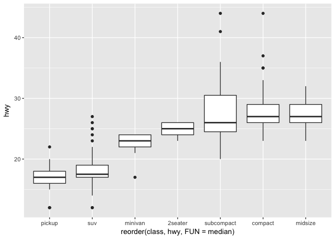<!-- -->

```r
ggplot(data = mpg) +
  geom_boxplot(mapping = aes(x = reorder(class, hwy, FUN = median), y = hwy)) +
  coord_flip()
```

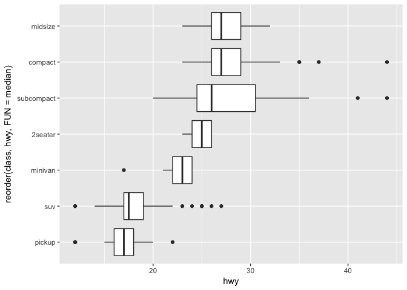<!-- -->

#####7.5.1.1 Exercise  
1. Use what you’ve learned to improve the visualisation of the departure times of cancelled vs. non-cancelled flights.  

```r
flights %>%
  mutate(
    cancelled = is.na(dep_time),
    sched_hour = sched_dep_time %/% 100,
    sched_min = sched_dep_time %% 100,
    sched_dep_time = sched_hour + sched_min / 60
  ) %>%
  ggplot(mapping = aes(x = sched_dep_time,y=..density..)) + 
    geom_freqpoly(mapping = aes(colour = cancelled), binwidth = 1/4)
```

<!-- -->

2. What variable in the diamonds dataset is most important for predicting the price of a diamond? How is that variable correlated with cut? Why does the combination of those two relationships lead to lower quality diamonds being more expensive?  

```r
#Hah. I have been thinking about this.
#Prediction value:
ggplot(data = diamonds, mapping = aes(x = carat, y = price)) +
  geom_point() +
  geom_smooth(se = FALSE, mapping = aes(colour = cut))
```

```
## `geom_smooth()` using method = 'gam'
```

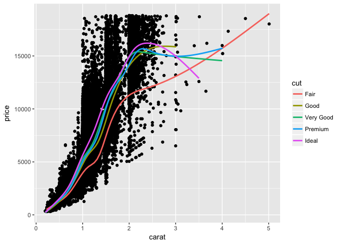<!-- -->

It looks like carat is a very strong predictor for price, due to the strong linear correlation betweent the two. It also looks like the finer the cut is for a particular diamond, the steeper slope of the linear correlation becomes. This would mean that finer cut diamonds have higher price for the same carat value. The implication is that coarser cut diamonds might look expensive simply because there are more heavier diamonds that fall into the "fair" cut category.   

3. Install the ggstance package, and create a horizontal boxplot. How does this compare to using coord_flip()?  

```r
library(ggstance)
```

```
## 
## Attaching package: 'ggstance'
```

```
## The following objects are masked from 'package:ggplot2':
## 
##     geom_errorbarh, GeomErrorbarh
```

```r
ggplot(data = diamonds, mapping = aes(x = cut, y = price)) +
  geom_boxplot() +
  coord_flip()
```

<!-- -->

```r
ggplot(data = diamonds, aes(x = price, y = cut)) +
  geom_boxploth()
```

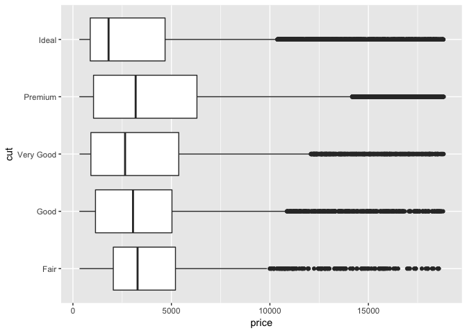<!-- -->

X and y axis need to be flipped for meaningful output. Other than that there is not really any difference.  

4. One problem with boxplots is that they were developed in an era of much smaller datasets and tend to display a prohibitively large number of “outlying values”. One approach to remedy this problem is the letter value plot. Install the lvplot package, and try using geom_lv() to display the distribution of price vs cut. What do you learn? How do you interpret the plots?  

*I did not do this question because it would require me to re-install a newer version of R... I might do it later...*

5. Compare and contrast geom_violin() with a facetted geom_histogram(), or a coloured geom_freqpoly(). What are the pros and cons of each method?  

```r
ggplot(data = diamonds, aes(x = cut, y = price)) +
  geom_violin()
```

<!-- -->

```r
ggplot(data = diamonds, aes(x = price, y = ..density..)) +
  facet_wrap(~cut, nrow = 1) +
  geom_histogram()
```

```
## `stat_bin()` using `bins = 30`. Pick better value with `binwidth`.
```

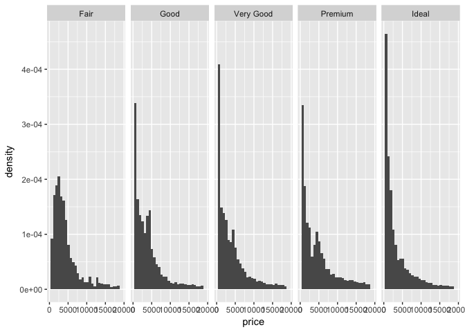<!-- -->

```r
ggplot(data = diamonds, mapping = aes(x = price, color = cut, y = ..density..)) +
  geom_freqpoly()
```

```
## `stat_bin()` using `bins = 30`. Pick better value with `binwidth`.
```

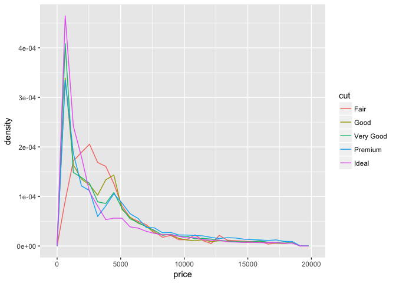<!-- -->

They are actually rather similar to each other as long as the histogram and frequency-polygon digrams were standardized to plot density. The fre_poly is basically all the violin plots overlapping on top of each other.   
6. If you have a small dataset, it’s sometimes useful to use geom_jitter() to see the relationship between a continuous and categorical variable. The ggbeeswarm package provides a number of methods similar to geom_jitter(). List them and briefly describe what each one does.  

```r
library(ggbeeswarm)
diamond.small  = diamonds %>%
  filter(carat < 1)
ggplot(data = diamond.small, mapping = aes(x = clarity, y = price, colour = carat)) +
  geom_point()
```

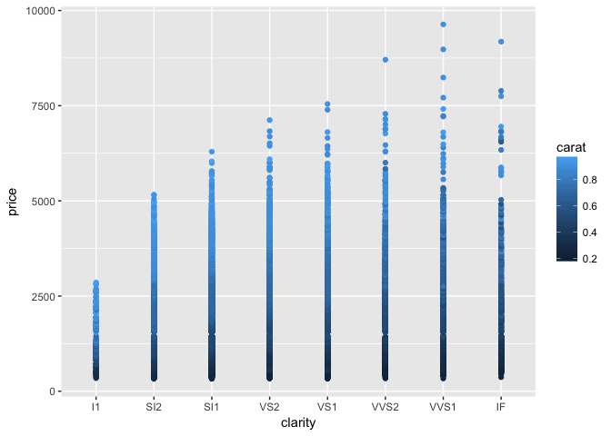<!-- -->

```r
ggplot(data = diamond.small, mapping = aes(x = clarity, y = price, colour = carat)) +
  geom_jitter() # there is barely any new information on this.
```

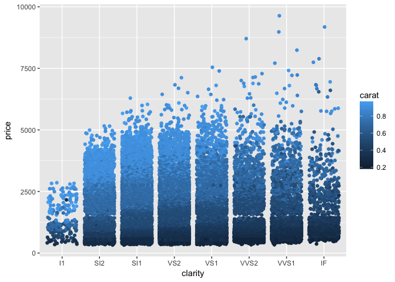<!-- -->

The dataset is still too big for my poor old computer to run ggbeeswarm on... I think ggbeeswarm can generate violin-plot-looking jitter dot plots (position_beeswarm). 

#####7.5.2 Two categorical variables

```r
ggplot(data = diamonds) +
  geom_count(mapping = aes(x = cut, y = color))
```

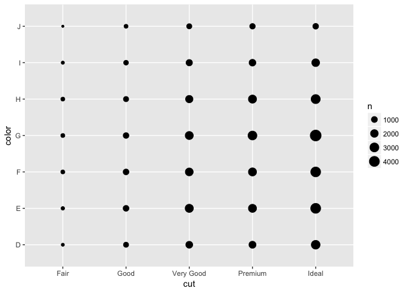<!-- -->

```r
diamonds %>% 
  count(color, cut) %>%  
  ggplot(mapping = aes(x = color, y = cut)) +
    geom_tile(mapping = aes(fill = n))
```

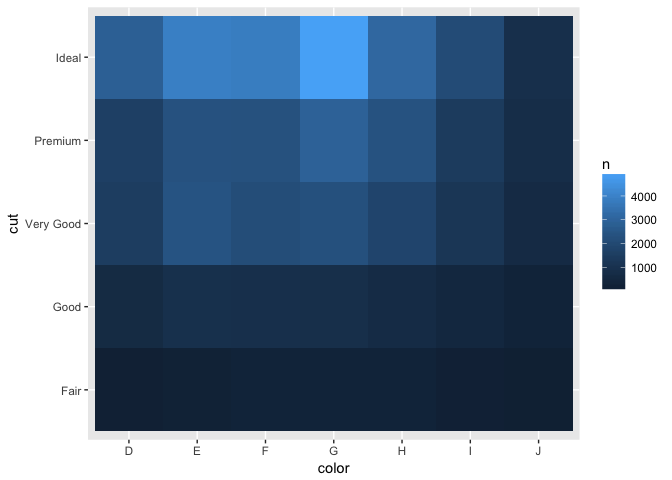<!-- -->

#####7.5.2.1 Exercises  
1. How could you rescale the count dataset above to more clearly show the distribution of cut within colour, or colour within cut?   
*No I don't know.*  

2. Use geom_tile() together with dplyr to explore how average flight delays vary by destination and month of year. What makes the plot difficult to read? How could you improve it?  

```r
library(dplyr)
flights %>%
  group_by(dest, month) %>%
  summarise(delay = mean(arr_delay, na.rm = TRUE)) %>%
  ggplot(mapping = aes(x = month, y = dest)) +
  geom_tile(mapping = aes(fill = delay))
```

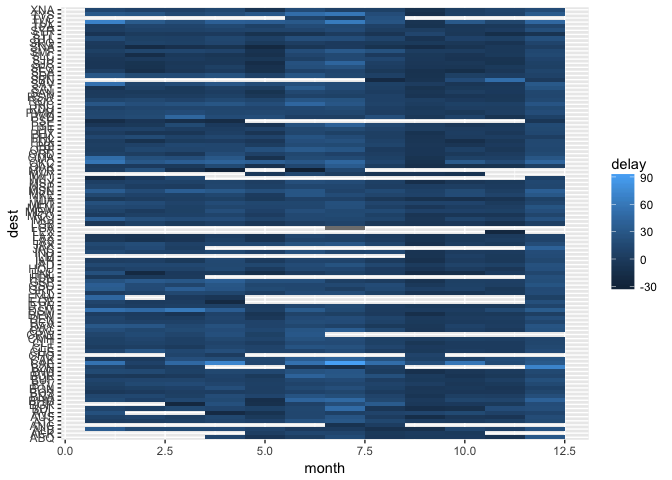<!-- -->

The destination labels are really hatd to read. I don't really know how to change that...  

3. Why is it slightly better to use aes(x = color, y = cut) rather than aes(x = cut, y = color) in the example above?  

```r
diamonds %>% 
  count(color, cut) %>%  
  ggplot(mapping = aes(x = cut, y = color)) +
    geom_tile(mapping = aes(fill = n))
```

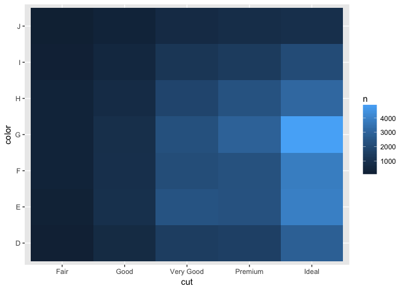<!-- -->

I honestly don't think one is better than the other -__-. Just in case the screen is not wide enough to accommendate all the letters that would have been on the x-axis if it was cut on x-axis?   

#####7.5.3 Two continuous variables

```r
ggplot(data = diamonds) +
  geom_point(mapping = aes(x = carat, y = price))
```

<!-- -->

```r
ggplot(data = diamonds) +
  geom_point(mapping = aes(x = carat, y = price), alpha = 0.01)
```

<!-- -->

```r
ggplot(data = smaller) +
  geom_bin2d(mapping = aes(x = carat, y = price))
```

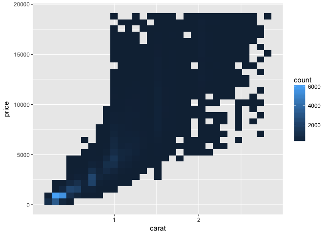<!-- -->

```r
library(hexbin)
ggplot(data = smaller) +
  geom_hex(mapping = aes(x = carat, y = price))
```

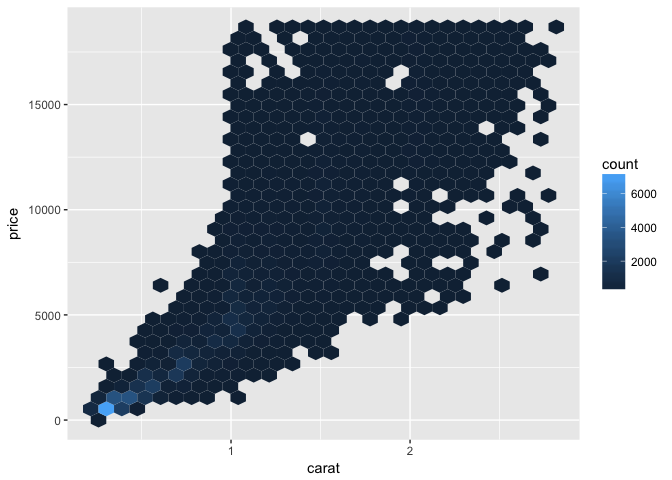<!-- -->

```r
ggplot(data = smaller, mapping = aes(x = carat, y = price)) + 
  geom_boxplot(mapping = aes(group = cut_width(carat, 0.1)))
```

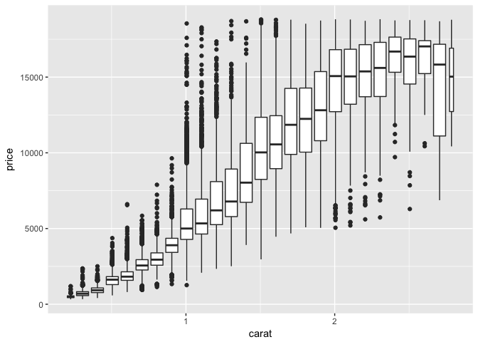<!-- -->

```r
ggplot(data = smaller, mapping = aes(x = carat, y = price)) + 
  geom_boxplot(mapping = aes(group = cut_number(carat, 20)))
```

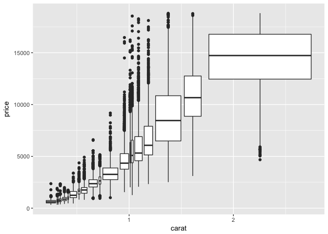<!-- -->

#####7.5.3.1 Excercises  

1. Instead of summarising the conditional distribution with a boxplot, you could use a frequency polygon. What do you need to consider when using cut_width() vs cut_number()? How does that impact a visualisation of the 2d distribution of carat and price?  

Cut width can overrepresent certain group by allocating the same width on the x-axis to groups of different sizes. But cut-number can be visually counterintuitive, becasue the groups that look the widest are actually where the observation distribution is the least dense.  

2. Visualise the distribution of carat, partitioned by price.  

```r
ggplot(data = diamonds, mapping = aes(x = price, y = carat)) + 
  geom_boxplot(mapping = aes(group = cut_width(price, 500)))
```

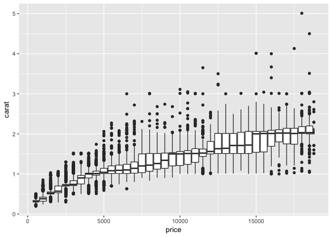<!-- -->

```r
ggplot(data = diamonds, mapping = aes(x = price, y = carat)) + 
  geom_boxplot(mapping = aes(group = cut_number(price, 20)))
```

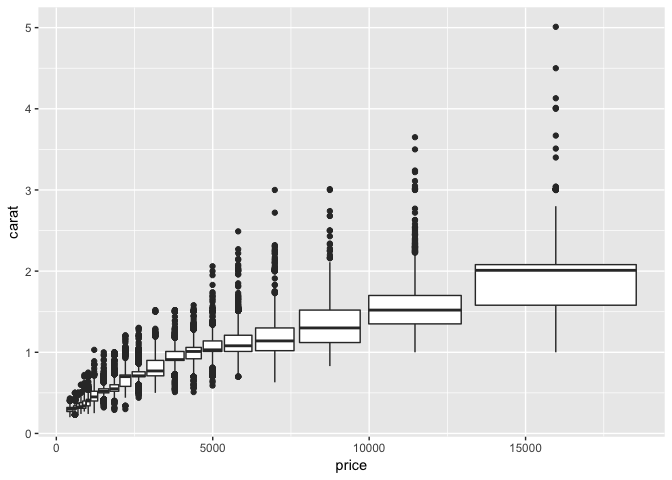<!-- -->

3. How does the price distribution of very large diamonds compare to small diamonds. Is it as you expect, or does it surprise you?   

```r
large = diamonds %>%
  filter(carat > 2.5)
small = diamonds %>%
  filter(carat < 0.25)
ggplot(mapping = aes(x=price, y = ..density..)) +
  geom_freqpoly(data = large, linetype = 2) +
  geom_freqpoly(data = small)
```

```
## `stat_bin()` using `bins = 30`. Pick better value with `binwidth`.
## `stat_bin()` using `bins = 30`. Pick better value with `binwidth`.
```

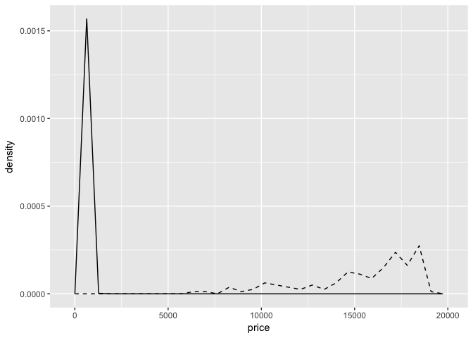<!-- -->

Should I be surprize?   

4. Combine two of the techniques you’ve learned to visualise the combined distribution of cut, carat, and price.  

```r
ggplot(data = diamonds, mapping = aes(x = carat, y = price)) +
  geom_boxplot(mapping = aes(group = cut_width(carat,1))) +
  geom_smooth(se = FALSE, mapping = aes(colour = cut))
```

```
## `geom_smooth()` using method = 'gam'
```

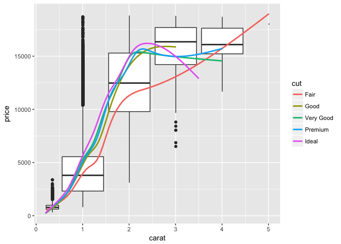<!-- -->

5. Why is a scatterplot a better display than a binned plot for find odd x-y combinations?

```r
ggplot(data = diamonds) +
  geom_point(mapping = aes(x = x, y = y)) +
  coord_cartesian(xlim = c(4, 11), ylim = c(4, 11))
```

<!-- -->

```r
ggplot(data = diamonds, mapping = aes(x = x, y = y)) +
  geom_boxplot(mapping = aes(group = cut_width(x,1))) +
  coord_cartesian(xlim = c(4, 11), ylim = c(4, 11))
```

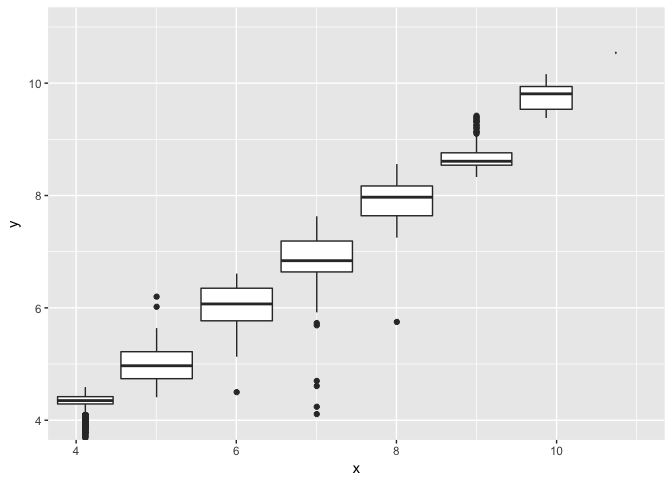<!-- -->

It looks like a lot of what could have been identified as outliers from the scatter plot was merged into the box of the box plot. In other works, the scatter plot had better resolution.   

