# Chapter 15 & 16

#Chapter 15: Factors  

##15.1.1 Prerequisites  

```r
library(tidyverse)
```

```
## Loading tidyverse: ggplot2
## Loading tidyverse: tibble
## Loading tidyverse: tidyr
## Loading tidyverse: readr
## Loading tidyverse: purrr
## Loading tidyverse: dplyr
```

```
## Conflicts with tidy packages ----------------------------------------------
```

```
## filter(): dplyr, stats
## lag():    dplyr, stats
```

```r
library(forcats)
```

##15.2 Crearing factors  

```r
x1 = c("Dec","Apr","Jan","Mar")
x2 = c("Dec","Apr","Jam","Mar")
month_levels = c("Jan","Feb","Mar","Apr","May","Jun","Jul","Aug","Sep","Oct","Nov","Dec")
y1 = factor(x1, levels = month_levels)
y1
```

```
## [1] Dec Apr Jan Mar
## Levels: Jan Feb Mar Apr May Jun Jul Aug Sep Oct Nov Dec
```

```r
sort(y1) #wow sorts in the order of the reference levels vector. 
```

```
## [1] Jan Mar Apr Dec
## Levels: Jan Feb Mar Apr May Jun Jul Aug Sep Oct Nov Dec
```

```r
y2 = parse_factor(x2, levels = month_levels) #gives warning for typo.
```

```
## Warning: 1 parsing failure.
## row # A tibble: 1 x 4 col     row   col           expected actual expected   <int> <int>              <chr>  <chr> actual 1     3    NA value in level set    Jam
```


```r
factor(x1) #w/o "levels=" input, levels are automatically sorted in alphabetical order.
```

```
## [1] Dec Apr Jan Mar
## Levels: Apr Dec Jan Mar
```

```r
f1 = factor(x1, levels = unique(x1)) #order of levels match the order of first appearance in the dataset
f1
```

```
## [1] Dec Apr Jan Mar
## Levels: Dec Apr Jan Mar
```

```r
f2 = x1 %>% factor() %>% fct_inorder() #order of levels match the order of first appearance. 
f2
```

```
## [1] Dec Apr Jan Mar
## Levels: Dec Apr Jan Mar
```

```r
levels(f2)
```

```
## [1] "Dec" "Apr" "Jan" "Mar"
```

##15.3 General Social Survey  

```r
head(gss_cat)
```

```
## # A tibble: 6 x 9
##    year       marital   age   race        rincome            partyid
##   <int>        <fctr> <int> <fctr>         <fctr>             <fctr>
## 1  2000 Never married    26  White  $8000 to 9999       Ind,near rep
## 2  2000      Divorced    48  White  $8000 to 9999 Not str republican
## 3  2000       Widowed    67  White Not applicable        Independent
## 4  2000 Never married    39  White Not applicable       Ind,near rep
## 5  2000      Divorced    25  White Not applicable   Not str democrat
## 6  2000       Married    25  White $20000 - 24999    Strong democrat
## # ... with 3 more variables: relig <fctr>, denom <fctr>, tvhours <int>
```

```r
gss_cat %>%
  count(race)
```

```
## # A tibble: 3 x 2
##     race     n
##   <fctr> <int>
## 1  Other  1959
## 2  Black  3129
## 3  White 16395
```

```r
ggplot(gss_cat, aes(x = race)) +
  geom_bar()
```

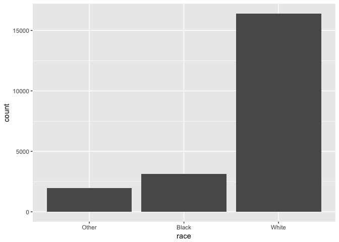<!-- -->

```r
ggplot(gss_cat, aes(x = race)) +
  geom_bar() +
  scale_x_discrete(drop = FALSE)
```

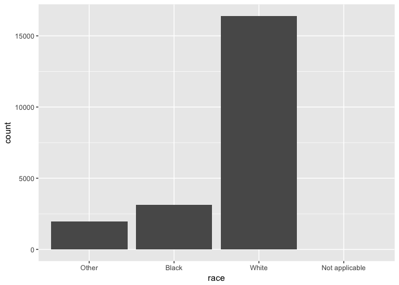<!-- -->

###15.3.1 Exercise    
1. Explore the distribution of rincome (reported income). What makes the default bar chart hard to understand? How could you improve the plot?  


```r
gss_cat %>%
  count(rincome)
```

```
## # A tibble: 16 x 2
##           rincome     n
##            <fctr> <int>
##  1      No answer   183
##  2     Don't know   267
##  3        Refused   975
##  4 $25000 or more  7363
##  5 $20000 - 24999  1283
##  6 $15000 - 19999  1048
##  7 $10000 - 14999  1168
##  8  $8000 to 9999   340
##  9  $7000 to 7999   188
## 10  $6000 to 6999   215
## 11  $5000 to 5999   227
## 12  $4000 to 4999   226
## 13  $3000 to 3999   276
## 14  $1000 to 2999   395
## 15       Lt $1000   286
## 16 Not applicable  7043
```

```r
ggplot(gss_cat, aes(x = rincome)) +
  geom_bar() +
  theme(text = element_text(size = 10), axis.text.x = element_text(angle = 45, hjust = 1))
```

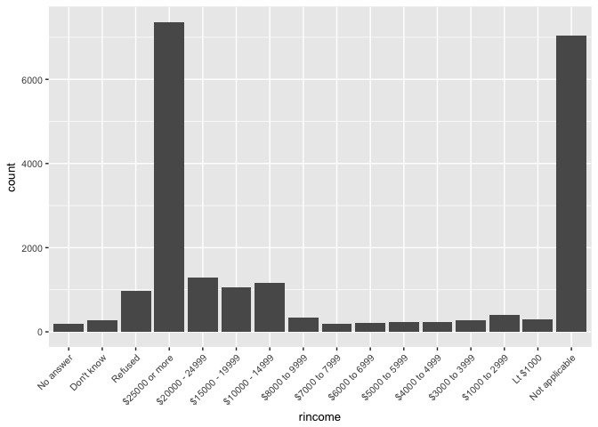<!-- -->

*The original bar chart is confusing because the lower income is on the right side of the x axis.* This can be fixed by manually ordering the levels in rincome.   


```r
level = names(table(gss_cat$rincome))[order(names(table(gss_cat$rincome)))]
ggplot(gss_cat, aes(x = factor(rincome, levels = level))) +
  geom_bar() +
  theme(text = element_text(size = 10), axis.text.x = element_text(angle = 45, hjust = 1))
```

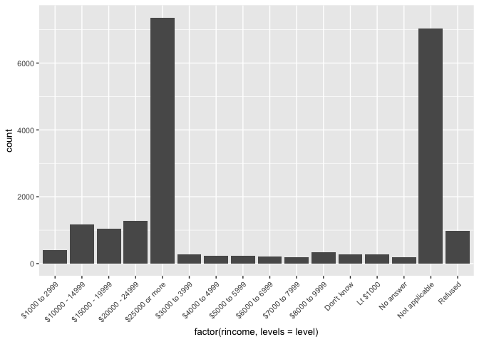<!-- -->

2. What is the most common relig in this survey? What’s the most common partyid?  
 

```r
ggplot(gss_cat) +
  geom_bar(aes(x = relig)) +
  theme(axis.text.x = element_text(size = 10, angle = 45, hjust = 1)) #Protestant
```

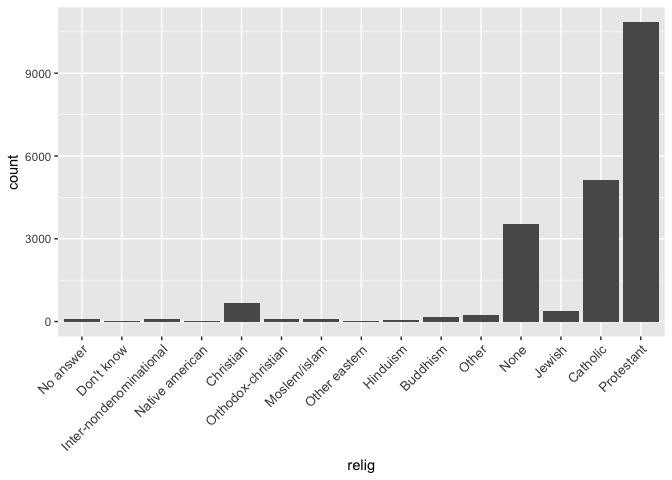<!-- -->

```r
ggplot(gss_cat) +
  geom_bar(aes(x = partyid)) +
  theme(text = element_text(size = 10), axis.text.x = element_text(angle = 45, hjust = 1)) #independent
```

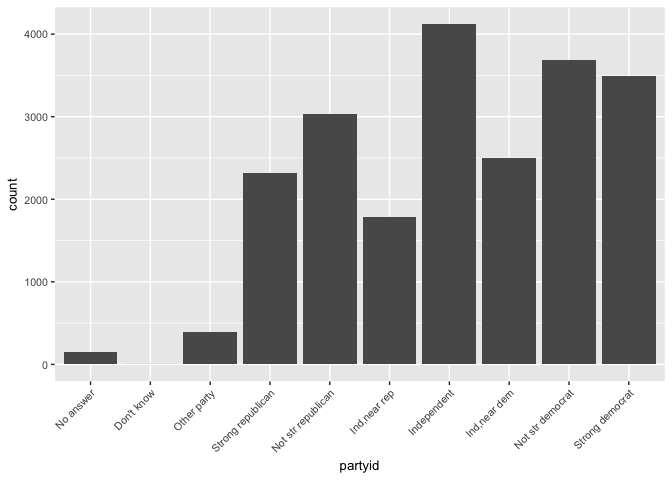<!-- -->

3. Which relig does denom (denomination) apply to? How can you find out with a table? How can you find out with a visualisation?  

```r
#Find out with a table:
by_relig = group_by(gss_cat, relig)
summarise(by_relig, Denomination = n_distinct(denom)) #Checking how many demoninations are under each religion.
```

```
## # A tibble: 15 x 2
##                      relig Denomination
##                     <fctr>        <int>
##  1               No answer            1
##  2              Don't know            1
##  3 Inter-nondenominational            1
##  4         Native american            1
##  5               Christian            4
##  6      Orthodox-christian            1
##  7            Moslem/islam            1
##  8           Other eastern            1
##  9                Hinduism            1
## 10                Buddhism            1
## 11                   Other            2
## 12                    None            1
## 13                  Jewish            1
## 14                Catholic            1
## 15              Protestant           29
```

```r
#Find out with visualization:
ggplot(gss_cat) +
  geom_bar(aes(x = relig , fill = denom)) +
  theme(axis.text.x = element_text(size = 10, angle = 45, hjust = 1)) # Christians and Protestants
```

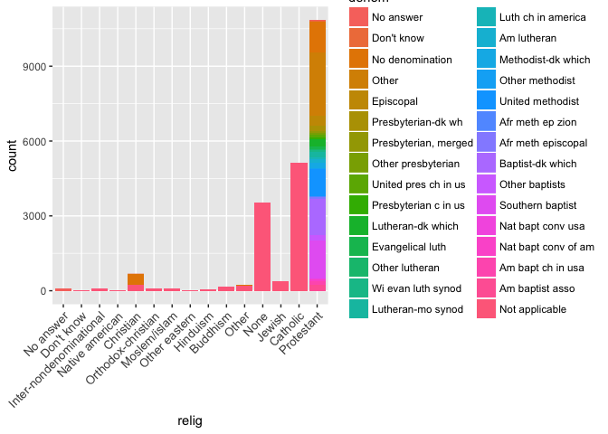<!-- -->

## 15.4 Modifying factor order  


```r
relig_summary = gss_cat %>%
  group_by(relig) %>%
  summarise(
    age = mean(age, na.rm = TRUE),
    tvhours = mean(tvhours, na.rm = TRUE),
    n = n()
  )
ggplot(relig_summary, aes(x = tvhours, y = relig)) + geom_point() # people who don't knwo what their religions are tend to watch more TV...?
```

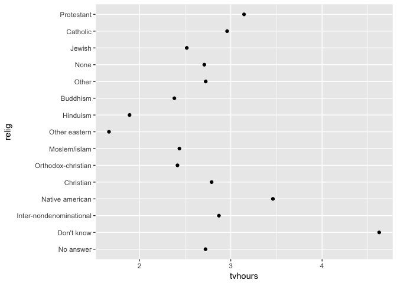<!-- -->

After reordering the y axis by the values on the x axis:  


```r
ggplot(relig_summary, aes(x = tvhours, y = fct_reorder(relig, tvhours))) + geom_point()
```

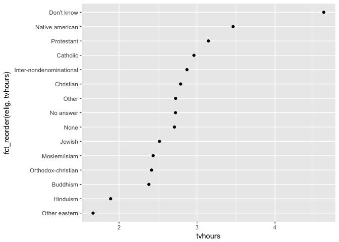<!-- -->

We can do the same thing by creating a separate coloumn. I like the previous method better tho:  


```r
relig_summary %>%
  mutate(relig = fct_reorder(relig, tvhours)) %>%
  ggplot(aes(tvhours, relig)) +
  geom_point()
```

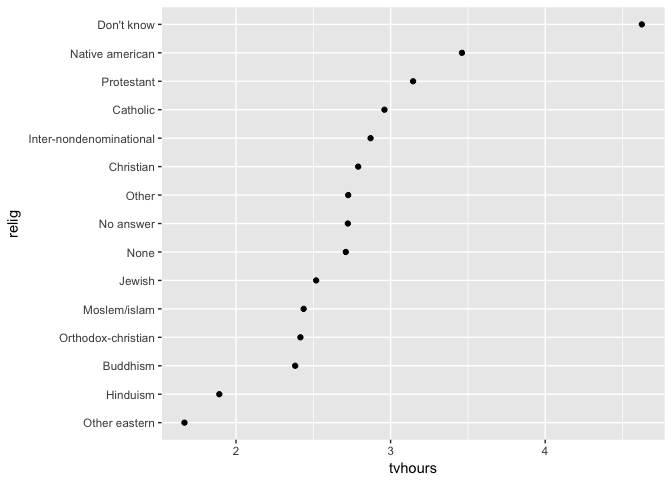<!-- -->


```r
rincome_summary = gss_cat %>%
  group_by(rincome) %>%
  summarise(age = mean(age, na.rm = TRUE), tvhours = mean(tvhours, na.rm = TRUE), n = n())

ggplot(rincome_summary) +
  geom_point(aes(x = age, y = fct_reorder(rincome, age)))
```

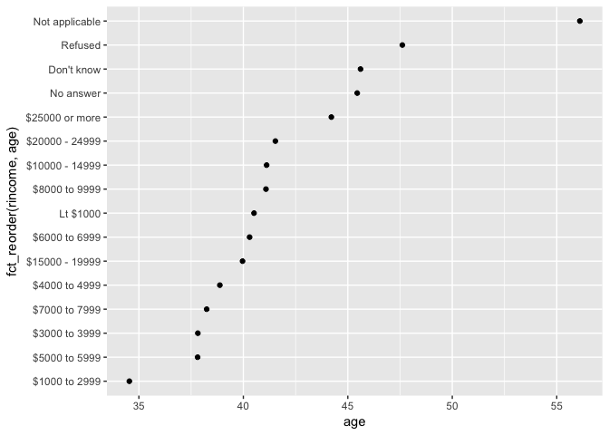<!-- -->

```r
ggplot(rincome_summary) +
  geom_point(aes(x = age, y = fct_relevel(rincome, "Not applicable"))) #put "Not applicable" at the front of the list. 
```

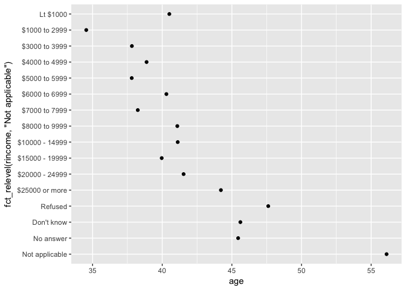<!-- -->


```r
by_am = gss_cat %>%
  filter(!is.na(age)) %>% #filter(!is.na()) is very smart
  group_by(age, marital) %>%
  count()
by_age = gss_cat %>%
  group_by(age) %>%
  count()
by_am
```

```
## # A tibble: 351 x 3
## # Groups:   age, marital [351]
##      age       marital     n
##    <int>        <fctr> <int>
##  1    18 Never married    89
##  2    18       Married     2
##  3    19 Never married   234
##  4    19      Divorced     3
##  5    19       Widowed     1
##  6    19       Married    11
##  7    20 Never married   227
##  8    20     Separated     1
##  9    20      Divorced     2
## 10    20       Married    21
## # ... with 341 more rows
```

```r
by_age
```

```
## # A tibble: 73 x 2
## # Groups:   age [73]
##      age     n
##    <int> <int>
##  1    18    91
##  2    19   249
##  3    20   251
##  4    21   278
##  5    22   298
##  6    23   361
##  7    24   344
##  8    25   396
##  9    26   400
## 10    27   385
## # ... with 63 more rows
```

```r
colnames(by_age) = c("age","N")
by_am = merge(by_am, by_age)
by_am = by_am %>%
  mutate(prop = n/N)

ggplot(by_am, aes(age, prop, colour = marital)) +
  geom_line(na.rm = TRUE)
```

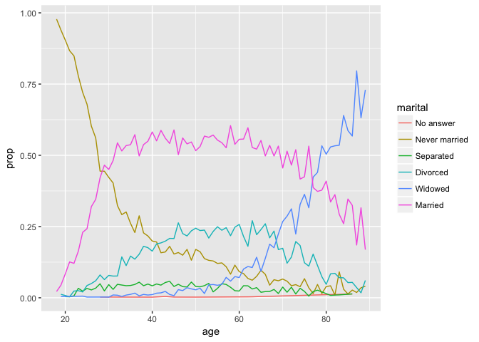<!-- -->

```r
ggplot(by_am, aes(age, prop, colour = fct_reorder2(marital, age, prop))) +
  geom_line() +
  labs(colour = "marital")
```

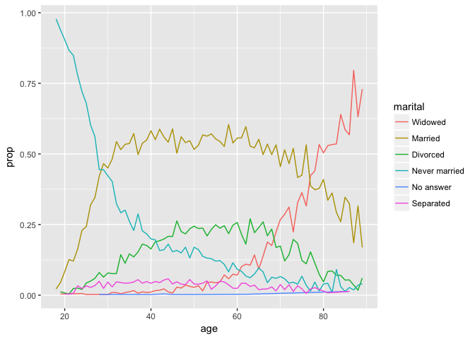<!-- -->

```r
gss_cat %>%
  mutate(marital = marital %>% fct_infreq() %>% fct_rev()) %>% #dont know what really happened here but ok.
  ggplot(aes(marital)) +
  geom_bar()
```

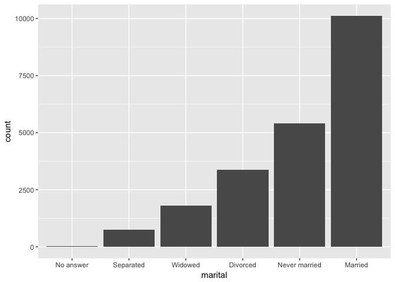<!-- -->

###15.4.1 Exercises  

1. There are some suspiciously high numbers in tvhours. Is the mean a good summary?

*maybe not...?*

2. For each factor in gss_cat identify whether the order of the levels is arbitrary or principled.


```r
colnames(gss_cat)
```

```
## [1] "year"    "marital" "age"     "race"    "rincome" "partyid" "relig"  
## [8] "denom"   "tvhours"
```

```r
levels(gss_cat$year)
```

```
## NULL
```

```r
levels(gss_cat$marital)
```

```
## [1] "No answer"     "Never married" "Separated"     "Divorced"     
## [5] "Widowed"       "Married"
```

```r
levels(gss_cat$rincome)
```

```
##  [1] "No answer"      "Don't know"     "Refused"        "$25000 or more"
##  [5] "$20000 - 24999" "$15000 - 19999" "$10000 - 14999" "$8000 to 9999" 
##  [9] "$7000 to 7999"  "$6000 to 6999"  "$5000 to 5999"  "$4000 to 4999" 
## [13] "$3000 to 3999"  "$1000 to 2999"  "Lt $1000"       "Not applicable"
```

Don't know the answer to the questions...  

3. Why did moving “Not applicable” to the front of the levels move it to the bottom of the plot?  

Because the front of the list is the closest to the x-axis.  

###15.5 Modifying factor levels  


```r
gss_cat %>%
  count(partyid)
```

```
## # A tibble: 10 x 2
##               partyid     n
##                <fctr> <int>
##  1          No answer   154
##  2         Don't know     1
##  3        Other party   393
##  4  Strong republican  2314
##  5 Not str republican  3032
##  6       Ind,near rep  1791
##  7        Independent  4119
##  8       Ind,near dem  2499
##  9   Not str democrat  3690
## 10    Strong democrat  3490
```

```r
gss_cat %>%
  mutate(partyid = fct_recode(partyid,
      "Republican, strong" = "Strong republican",
      "Republican, weak"      = "Not str republican",
      "Independent, near rep" = "Ind,near rep",
      "Independent, near dem" = "Ind,near dem",
      "Democrat, weak"        = "Not str democrat",
      "Democrat, strong"      = "Strong democrat")) %>%
  count(partyid)
```

```
## # A tibble: 10 x 2
##                  partyid     n
##                   <fctr> <int>
##  1             No answer   154
##  2            Don't know     1
##  3           Other party   393
##  4    Republican, strong  2314
##  5      Republican, weak  3032
##  6 Independent, near rep  1791
##  7           Independent  4119
##  8 Independent, near dem  2499
##  9        Democrat, weak  3690
## 10      Democrat, strong  3490
```

```r
gss_cat %>%
  mutate(partyid = fct_recode(partyid,
    "Republican, strong"    = "Strong republican",
    "Republican, weak"      = "Not str republican",
    "Independent, near rep" = "Ind,near rep",
    "Independent, near dem" = "Ind,near dem",
    "Democrat, weak"        = "Not str democrat",
    "Democrat, strong"      = "Strong democrat",
    "Other"                 = "No answer",
    "Other"                 = "Don't know",
    "Other"                 = "Other party"
  )) %>%
  count(partyid)
```

```
## # A tibble: 8 x 2
##                 partyid     n
##                  <fctr> <int>
## 1                 Other   548
## 2    Republican, strong  2314
## 3      Republican, weak  3032
## 4 Independent, near rep  1791
## 5           Independent  4119
## 6 Independent, near dem  2499
## 7        Democrat, weak  3690
## 8      Democrat, strong  3490
```


```r
gss_cat %>%
  mutate(partyid = fct_collapse(partyid,
    other = c("No answer", "Don't know", "Other party"),
    rep = c("Strong republican", "Not str republican"),
    ind = c("Ind,near rep", "Independent", "Ind,near dem"),
    dem = c("Not str democrat", "Strong democrat")
  )) %>%
  count(partyid)
```

```
## # A tibble: 4 x 2
##   partyid     n
##    <fctr> <int>
## 1   other   548
## 2     rep  5346
## 3     ind  8409
## 4     dem  7180
```


```r
gss_cat %>%
  mutate(relig = fct_lump(relig)) %>%
  count(relig)
```

```
## # A tibble: 2 x 2
##        relig     n
##       <fctr> <int>
## 1 Protestant 10846
## 2      Other 10637
```


```r
gss_cat %>%
  mutate(relig = fct_lump(relig, n= 10)) %>%
  count(relig, sort = TRUE) %>%
  print()
```

```
## # A tibble: 10 x 2
##                      relig     n
##                     <fctr> <int>
##  1              Protestant 10846
##  2                Catholic  5124
##  3                    None  3523
##  4               Christian   689
##  5                   Other   458
##  6                  Jewish   388
##  7                Buddhism   147
##  8 Inter-nondenominational   109
##  9            Moslem/islam   104
## 10      Orthodox-christian    95
```


```r
by_partyage = gss_cat %>%
  mutate(partyid = fct_recode(partyid,
    "Republican, strong"    = "Strong republican",
    "Republican, weak"      = "Not str republican",
    "Independent, near rep" = "Ind,near rep",
    "Independent, near dem" = "Ind,near dem",
    "Democrat, weak"        = "Not str democrat",
    "Democrat, strong"      = "Strong democrat",
    "Other"                 = "No answer",
    "Other"                 = "Don't know",
    "Other"                 = "Other party"
  )) %>%
  group_by(age, partyid) %>%
  count()
by_partyage
```

```
## # A tibble: 583 x 3
## # Groups:   age, partyid [583]
##      age               partyid     n
##    <int>                <fctr> <int>
##  1    18                 Other     3
##  2    18    Republican, strong     5
##  3    18      Republican, weak     9
##  4    18 Independent, near rep     7
##  5    18           Independent    22
##  6    18 Independent, near dem    19
##  7    18        Democrat, weak    15
##  8    18      Democrat, strong    11
##  9    19                 Other     7
## 10    19    Republican, strong    13
## # ... with 573 more rows
```

```r
by_age = gss_cat %>%
  group_by(age) %>%
  count()
by_age
```

```
## # A tibble: 73 x 2
## # Groups:   age [73]
##      age     n
##    <int> <int>
##  1    18    91
##  2    19   249
##  3    20   251
##  4    21   278
##  5    22   298
##  6    23   361
##  7    24   344
##  8    25   396
##  9    26   400
## 10    27   385
## # ... with 63 more rows
```

```r
colnames(by_age)[2] = "N"

by_partyage = merge(by_partyage, by_age)
by_partyage
```

```
##     age               partyid   n   N
## 1    18                 Other   3  91
## 2    18    Republican, strong   5  91
## 3    18      Republican, weak   9  91
## 4    18 Independent, near rep   7  91
## 5    18           Independent  22  91
## 6    18 Independent, near dem  19  91
## 7    18        Democrat, weak  15  91
## 8    18      Democrat, strong  11  91
## 9    19                 Other   7 249
## 10   19    Republican, strong  13 249
## 11   19      Republican, weak  36 249
## 12   19 Independent, near rep  22 249
## 13   19           Independent  71 249
## 14   19 Independent, near dem  30 249
## 15   19        Democrat, weak  43 249
## 16   19      Democrat, strong  27 249
## 17   20                 Other  12 251
## 18   20    Republican, strong  10 251
## 19   20      Republican, weak  31 251
## 20   20 Independent, near rep  20 251
## 21   20           Independent  66 251
## 22   20 Independent, near dem  44 251
## 23   20        Democrat, weak  36 251
## 24   20      Democrat, strong  32 251
## 25   21                 Other   2 278
## 26   21    Republican, strong  14 278
## 27   21      Republican, weak  48 278
## 28   21 Independent, near rep  23 278
## 29   21           Independent  73 278
## 30   21 Independent, near dem  43 278
## 31   21        Democrat, weak  51 278
## 32   21      Democrat, strong  24 278
## 33   22                 Other   5 298
## 34   22    Republican, strong  14 298
## 35   22      Republican, weak  36 298
## 36   22 Independent, near rep  24 298
## 37   22           Independent  82 298
## 38   22 Independent, near dem  53 298
## 39   22        Democrat, weak  57 298
## 40   22      Democrat, strong  27 298
## 41   23                 Other   9 361
## 42   23    Republican, strong  21 361
## 43   23      Republican, weak  54 361
## 44   23 Independent, near rep  25 361
## 45   23           Independent  98 361
## 46   23 Independent, near dem  58 361
## 47   23        Democrat, weak  67 361
## 48   23      Democrat, strong  29 361
## 49   24                 Other  13 344
## 50   24    Republican, strong  14 344
## 51   24      Republican, weak  48 344
## 52   24 Independent, near rep  37 344
## 53   24           Independent  77 344
## 54   24 Independent, near dem  51 344
## 55   24        Democrat, weak  67 344
## 56   24      Democrat, strong  37 344
## 57   25                 Other  16 396
## 58   25    Republican, strong  20 396
## 59   25      Republican, weak  56 396
## 60   25 Independent, near rep  32 396
## 61   25           Independent  95 396
## 62   25 Independent, near dem  57 396
## 63   25        Democrat, weak  76 396
## 64   25      Democrat, strong  44 396
## 65   26                 Other   7 400
## 66   26    Republican, strong  17 400
## 67   26      Republican, weak  52 400
## 68   26 Independent, near rep  41 400
## 69   26           Independent  94 400
## 70   26 Independent, near dem  68 400
## 71   26        Democrat, weak  76 400
## 72   26      Democrat, strong  45 400
## 73   27                 Other   8 385
## 74   27    Republican, strong  27 385
## 75   27      Republican, weak  44 385
## 76   27 Independent, near rep  44 385
## 77   27           Independent  89 385
## 78   27 Independent, near dem  49 385
## 79   27        Democrat, weak  78 385
## 80   27      Democrat, strong  46 385
## 81   28                 Other   5 387
## 82   28    Republican, strong  29 387
## 83   28      Republican, weak  52 387
## 84   28 Independent, near rep  22 387
## 85   28           Independent 108 387
## 86   28 Independent, near dem  61 387
## 87   28        Democrat, weak  68 387
## 88   28      Democrat, strong  42 387
## 89   29                 Other   8 376
## 90   29    Republican, strong  33 376
## 91   29      Republican, weak  55 376
## 92   29 Independent, near rep  27 376
## 93   29           Independent  86 376
## 94   29 Independent, near dem  45 376
## 95   29        Democrat, weak  61 376
## 96   29      Democrat, strong  61 376
## 97   30                 Other   9 433
## 98   30    Republican, strong  42 433
## 99   30      Republican, weak  64 433
## 100  30 Independent, near rep  34 433
## 101  30           Independent 104 433
## 102  30 Independent, near dem  48 433
## 103  30        Democrat, weak  84 433
## 104  30      Democrat, strong  48 433
## 105  31                 Other   9 407
## 106  31    Republican, strong  34 407
## 107  31      Republican, weak  43 407
## 108  31 Independent, near rep  36 407
## 109  31           Independent 102 407
## 110  31 Independent, near dem  50 407
## 111  31        Democrat, weak  75 407
## 112  31      Democrat, strong  58 407
## 113  32                 Other   9 445
## 114  32    Republican, strong  40 445
## 115  32      Republican, weak  63 445
## 116  32 Independent, near rep  39 445
## 117  32           Independent 110 445
## 118  32 Independent, near dem  52 445
## 119  32        Democrat, weak  69 445
## 120  32      Democrat, strong  63 445
## 121  33                 Other   7 425
## 122  33    Republican, strong  33 425
## 123  33      Republican, weak  70 425
## 124  33 Independent, near rep  24 425
## 125  33           Independent 106 425
## 126  33 Independent, near dem  42 425
## 127  33        Democrat, weak  80 425
## 128  33      Democrat, strong  63 425
## 129  34                 Other  15 425
## 130  34    Republican, strong  35 425
## 131  34      Republican, weak  57 425
## 132  34 Independent, near rep  32 425
## 133  34           Independent  91 425
## 134  34 Independent, near dem  64 425
## 135  34        Democrat, weak  79 425
## 136  34      Democrat, strong  52 425
## 137  35                 Other  14 417
## 138  35    Republican, strong  38 417
## 139  35      Republican, weak  61 417
## 140  35 Independent, near rep  38 417
## 141  35           Independent  94 417
## 142  35 Independent, near dem  42 417
## 143  35        Democrat, weak  86 417
## 144  35      Democrat, strong  44 417
## 145  36                 Other  12 428
## 146  36    Republican, strong  47 428
## 147  36      Republican, weak  60 428
## 148  36 Independent, near rep  43 428
## 149  36           Independent  78 428
## 150  36 Independent, near dem  54 428
## 151  36        Democrat, weak  66 428
## 152  36      Democrat, strong  68 428
## 153  37                 Other   9 438
## 154  37    Republican, strong  42 438
## 155  37      Republican, weak  58 438
## 156  37 Independent, near rep  44 438
## 157  37           Independent  97 438
## 158  37 Independent, near dem  50 438
## 159  37        Democrat, weak  75 438
## 160  37      Democrat, strong  63 438
## 161  38                 Other  15 426
## 162  38    Republican, strong  43 426
## 163  38      Republican, weak  62 426
## 164  38 Independent, near rep  30 426
## 165  38           Independent  93 426
## 166  38 Independent, near dem  47 426
## 167  38        Democrat, weak  79 426
## 168  38      Democrat, strong  57 426
## 169  39                 Other  11 415
## 170  39    Republican, strong  44 415
## 171  39      Republican, weak  62 415
## 172  39 Independent, near rep  40 415
## 173  39           Independent  76 415
## 174  39 Independent, near dem  40 415
## 175  39        Democrat, weak  84 415
## 176  39      Democrat, strong  58 415
## 177  40                 Other  13 452
## 178  40    Republican, strong  53 452
## 179  40      Republican, weak  69 452
## 180  40 Independent, near rep  32 452
## 181  40           Independent  92 452
## 182  40 Independent, near dem  45 452
## 183  40        Democrat, weak  73 452
## 184  40      Democrat, strong  75 452
## 185  41                 Other   8 434
## 186  41    Republican, strong  49 434
## 187  41      Republican, weak  69 434
## 188  41 Independent, near rep  36 434
## 189  41           Independent  82 434
## 190  41 Independent, near dem  43 434
## 191  41        Democrat, weak  86 434
## 192  41      Democrat, strong  61 434
## 193  42                 Other   9 405
## 194  42    Republican, strong  42 405
## 195  42      Republican, weak  69 405
## 196  42 Independent, near rep  33 405
## 197  42           Independent  72 405
## 198  42 Independent, near dem  53 405
## 199  42        Democrat, weak  66 405
## 200  42      Democrat, strong  61 405
## 201  43                 Other  13 448
## 202  43    Republican, strong  58 448
## 203  43      Republican, weak  68 448
## 204  43 Independent, near rep  28 448
## 205  43           Independent 102 448
## 206  43 Independent, near dem  43 448
## 207  43        Democrat, weak  76 448
## 208  43      Democrat, strong  60 448
## 209  44                 Other   7 432
## 210  44    Republican, strong  53 432
## 211  44      Republican, weak  67 432
## 212  44 Independent, near rep  42 432
## 213  44           Independent  86 432
## 214  44 Independent, near dem  34 432
## 215  44        Democrat, weak  71 432
## 216  44      Democrat, strong  72 432
## 217  45                 Other  12 404
## 218  45    Republican, strong  45 404
## 219  45      Republican, weak  62 404
## 220  45 Independent, near rep  34 404
## 221  45           Independent  70 404
## 222  45 Independent, near dem  57 404
## 223  45        Democrat, weak  64 404
## 224  45      Democrat, strong  60 404
## 225  46                 Other   7 422
## 226  46    Republican, strong  51 422
## 227  46      Republican, weak  67 422
## 228  46 Independent, near rep  36 422
## 229  46           Independent  76 422
## 230  46 Independent, near dem  50 422
## 231  46        Democrat, weak  81 422
## 232  46      Democrat, strong  54 422
## 233  47                 Other  12 435
## 234  47    Republican, strong  36 435
## 235  47      Republican, weak  70 435
## 236  47 Independent, near rep  33 435
## 237  47           Independent  84 435
## 238  47 Independent, near dem  54 435
## 239  47        Democrat, weak  76 435
## 240  47      Democrat, strong  70 435
## 241  48                 Other  14 424
## 242  48    Republican, strong  50 424
## 243  48      Republican, weak  52 424
## 244  48 Independent, near rep  34 424
## 245  48           Independent  85 424
## 246  48 Independent, near dem  48 424
## 247  48        Democrat, weak  62 424
## 248  48      Democrat, strong  79 424
## 249  49                 Other   9 417
## 250  49    Republican, strong  47 417
## 251  49      Republican, weak  66 417
## 252  49 Independent, near rep  36 417
## 253  49           Independent  85 417
## 254  49 Independent, near dem  42 417
## 255  49        Democrat, weak  67 417
## 256  49      Democrat, strong  65 417
## 257  50                 Other  18 430
## 258  50    Republican, strong  49 430
## 259  50      Republican, weak  54 430
## 260  50 Independent, near rep  36 430
## 261  50           Independent  80 430
## 262  50 Independent, near dem  41 430
## 263  50        Democrat, weak  69 430
## 264  50      Democrat, strong  83 430
## 265  51                 Other   7 390
## 266  51    Republican, strong  43 390
## 267  51      Republican, weak  57 390
## 268  51 Independent, near rep  32 390
## 269  51           Independent  77 390
## 270  51 Independent, near dem  49 390
## 271  51        Democrat, weak  71 390
## 272  51      Democrat, strong  54 390
## 273  52                 Other   6 400
## 274  52    Republican, strong  42 400
## 275  52      Republican, weak  63 400
## 276  52 Independent, near rep  41 400
## 277  52           Independent  71 400
## 278  52 Independent, near dem  53 400
## 279  52        Democrat, weak  53 400
## 280  52      Democrat, strong  71 400
## 281  53                 Other  11 396
## 282  53    Republican, strong  41 396
## 283  53      Republican, weak  57 396
## 284  53 Independent, near rep  28 396
## 285  53           Independent  77 396
## 286  53 Independent, near dem  35 396
## 287  53        Democrat, weak  69 396
## 288  53      Democrat, strong  78 396
## 289  54                 Other  15 387
## 290  54    Republican, strong  39 387
## 291  54      Republican, weak  51 387
## 292  54 Independent, near rep  24 387
## 293  54           Independent  60 387
## 294  54 Independent, near dem  44 387
## 295  54        Democrat, weak  70 387
## 296  54      Democrat, strong  84 387
## 297  55                 Other  14 365
## 298  55    Republican, strong  42 365
## 299  55      Republican, weak  52 365
## 300  55 Independent, near rep  29 365
## 301  55           Independent  60 365
## 302  55 Independent, near dem  44 365
## 303  55        Democrat, weak  64 365
## 304  55      Democrat, strong  60 365
## 305  56                 Other   8 384
## 306  56    Republican, strong  56 384
## 307  56      Republican, weak  47 384
## 308  56 Independent, near rep  35 384
## 309  56           Independent  68 384
## 310  56 Independent, near dem  42 384
## 311  56        Democrat, weak  62 384
## 312  56      Democrat, strong  66 384
## 313  57                 Other  11 321
## 314  57    Republican, strong  24 321
## 315  57      Republican, weak  40 321
## 316  57 Independent, near rep  24 321
## 317  57           Independent  52 321
## 318  57 Independent, near dem  39 321
## 319  57        Democrat, weak  64 321
## 320  57      Democrat, strong  67 321
## 321  58                 Other  10 326
## 322  58    Republican, strong  37 326
## 323  58      Republican, weak  50 326
## 324  58 Independent, near rep  31 326
## 325  58           Independent  59 326
## 326  58 Independent, near dem  35 326
## 327  58        Democrat, weak  43 326
## 328  58      Democrat, strong  61 326
## 329  59                 Other  10 323
## 330  59    Republican, strong  38 323
## 331  59      Republican, weak  41 323
## 332  59 Independent, near rep  25 323
## 333  59           Independent  56 323
## 334  59 Independent, near dem  37 323
## 335  59        Democrat, weak  55 323
## 336  59      Democrat, strong  61 323
## 337  60                 Other   4 338
## 338  60    Republican, strong  32 338
## 339  60      Republican, weak  48 338
## 340  60 Independent, near rep  25 338
## 341  60           Independent  62 338
## 342  60 Independent, near dem  52 338
## 343  60        Democrat, weak  42 338
## 344  60      Democrat, strong  73 338
## 345  61                 Other   5 307
## 346  61    Republican, strong  48 307
## 347  61      Republican, weak  40 307
## 348  61 Independent, near rep  29 307
## 349  61           Independent  43 307
## 350  61 Independent, near dem  39 307
## 351  61        Democrat, weak  53 307
## 352  61      Democrat, strong  50 307
## 353  62                 Other   5 310
## 354  62    Republican, strong  42 310
## 355  62      Republican, weak  42 310
## 356  62 Independent, near rep  35 310
## 357  62           Independent  44 310
## 358  62 Independent, near dem  36 310
## 359  62        Democrat, weak  50 310
## 360  62      Democrat, strong  56 310
## 361  63                 Other   9 292
## 362  63    Republican, strong  42 292
## 363  63      Republican, weak  41 292
## 364  63 Independent, near rep  25 292
## 365  63           Independent  40 292
## 366  63 Independent, near dem  33 292
## 367  63        Democrat, weak  44 292
## 368  63      Democrat, strong  58 292
## 369  64                 Other   8 253
## 370  64    Republican, strong  47 253
## 371  64      Republican, weak  30 253
## 372  64 Independent, near rep  18 253
## 373  64           Independent  32 253
## 374  64 Independent, near dem  32 253
## 375  64        Democrat, weak  36 253
## 376  64      Democrat, strong  50 253
## 377  65                 Other   5 259
## 378  65    Republican, strong  46 259
## 379  65      Republican, weak  34 259
## 380  65 Independent, near rep  27 259
## 381  65           Independent  32 259
## 382  65 Independent, near dem  22 259
## 383  65        Democrat, weak  50 259
## 384  65      Democrat, strong  43 259
## 385  66                 Other   8 231
## 386  66    Republican, strong  33 231
## 387  66      Republican, weak  24 231
## 388  66 Independent, near rep  21 231
## 389  66           Independent  30 231
## 390  66 Independent, near dem  27 231
## 391  66        Democrat, weak  32 231
## 392  66      Democrat, strong  56 231
## 393  67                 Other   5 271
## 394  67    Republican, strong  35 271
## 395  67      Republican, weak  38 271
## 396  67 Independent, near rep  23 271
## 397  67           Independent  32 271
## 398  67 Independent, near dem  26 271
## 399  67        Democrat, weak  44 271
## 400  67      Democrat, strong  68 271
## 401  68                 Other   6 205
## 402  68    Republican, strong  32 205
## 403  68      Republican, weak  22 205
## 404  68 Independent, near rep  19 205
## 405  68           Independent  30 205
## 406  68 Independent, near dem  21 205
## 407  68        Democrat, weak  30 205
## 408  68      Democrat, strong  45 205
## 409  69                 Other   7 201
## 410  69    Republican, strong  27 201
## 411  69      Republican, weak  25 201
## 412  69 Independent, near rep  21 201
## 413  69           Independent  23 201
## 414  69 Independent, near dem  26 201
## 415  69        Democrat, weak  31 201
## 416  69      Democrat, strong  41 201
## 417  70                 Other   4 213
## 418  70    Republican, strong  36 213
## 419  70      Republican, weak  27 213
## 420  70 Independent, near rep  20 213
## 421  70           Independent  20 213
## 422  70 Independent, near dem  15 213
## 423  70        Democrat, weak  43 213
## 424  70      Democrat, strong  48 213
## 425  71                 Other   7 206
## 426  71    Republican, strong  23 206
## 427  71      Republican, weak  36 206
## 428  71 Independent, near rep  19 206
## 429  71           Independent  26 206
## 430  71 Independent, near dem  17 206
## 431  71        Democrat, weak  31 206
## 432  71      Democrat, strong  47 206
## 433  72                 Other   1 189
## 434  72    Republican, strong  34 189
## 435  72      Republican, weak  28 189
## 436  72 Independent, near rep  21 189
## 437  72           Independent  23 189
## 438  72 Independent, near dem  14 189
## 439  72        Democrat, weak  31 189
## 440  72      Democrat, strong  37 189
## 441  73                 Other   1 152
## 442  73    Republican, strong  24 152
## 443  73      Republican, weak  23 152
## 444  73 Independent, near rep  10 152
## 445  73           Independent  19 152
## 446  73 Independent, near dem  16 152
## 447  73        Democrat, weak  28 152
## 448  73      Democrat, strong  31 152
## 449  74                 Other   5 180
## 450  74    Republican, strong  30 180
## 451  74      Republican, weak  19 180
## 452  74 Independent, near rep  15 180
## 453  74           Independent  33 180
## 454  74 Independent, near dem  14 180
## 455  74        Democrat, weak  30 180
## 456  74      Democrat, strong  34 180
## 457  75                 Other   4 179
## 458  75    Republican, strong  24 179
## 459  75      Republican, weak  22 179
## 460  75 Independent, near rep  16 179
## 461  75           Independent  29 179
## 462  75 Independent, near dem  16 179
## 463  75        Democrat, weak  33 179
## 464  75      Democrat, strong  35 179
## 465  76                 Other   2 171
## 466  76    Republican, strong  32 171
## 467  76      Republican, weak  22 171
## 468  76 Independent, near rep  11 171
## 469  76           Independent  18 171
## 470  76 Independent, near dem  18 171
## 471  76        Democrat, weak  28 171
## 472  76      Democrat, strong  40 171
## 473  77                 Other   3 137
## 474  77    Republican, strong  21 137
## 475  77      Republican, weak  22 137
## 476  77 Independent, near rep  14 137
## 477  77           Independent  18 137
## 478  77 Independent, near dem   8 137
## 479  77        Democrat, weak  21 137
## 480  77      Democrat, strong  30 137
## 481  78                 Other   3 150
## 482  78    Republican, strong  22 150
## 483  78      Republican, weak  21 150
## 484  78 Independent, near rep  11 150
## 485  78           Independent  19 150
## 486  78 Independent, near dem  16 150
## 487  78        Democrat, weak  22 150
## 488  78      Democrat, strong  36 150
## 489  79                 Other   4 135
## 490  79    Republican, strong  20 135
## 491  79      Republican, weak  25 135
## 492  79 Independent, near rep  13 135
## 493  79           Independent  14 135
## 494  79 Independent, near dem   9 135
## 495  79        Democrat, weak  22 135
## 496  79      Democrat, strong  28 135
## 497  80                 Other   1 127
## 498  80    Republican, strong  27 127
## 499  80      Republican, weak  18 127
## 500  80 Independent, near rep   9 127
## 501  80           Independent  10 127
## 502  80 Independent, near dem  10 127
## 503  80        Democrat, weak  22 127
## 504  80      Democrat, strong  30 127
## 505  81                 Other   5 119
## 506  81    Republican, strong  16 119
## 507  81      Republican, weak  13 119
## 508  81 Independent, near rep   7 119
## 509  81           Independent  11 119
## 510  81 Independent, near dem  11 119
## 511  81        Democrat, weak  22 119
## 512  81      Democrat, strong  34 119
## 513  82                 Other   2 105
## 514  82    Republican, strong  20 105
## 515  82      Republican, weak  15 105
## 516  82 Independent, near rep   9 105
## 517  82           Independent  11 105
## 518  82 Independent, near dem   6 105
## 519  82        Democrat, weak  16 105
## 520  82      Democrat, strong  26 105
## 521  83                 Other   3  99
## 522  83    Republican, strong   9  99
## 523  83      Republican, weak  17  99
## 524  83 Independent, near rep   7  99
## 525  83           Independent  16  99
## 526  83 Independent, near dem  10  99
## 527  83        Democrat, weak  14  99
## 528  83      Democrat, strong  23  99
## 529  84                 Other   3 100
## 530  84    Republican, strong  15 100
## 531  84      Republican, weak  12 100
## 532  84 Independent, near rep   7 100
## 533  84           Independent  13 100
## 534  84 Independent, near dem  14 100
## 535  84        Democrat, weak  15 100
## 536  84      Democrat, strong  21 100
## 537  85    Republican, strong   8  75
## 538  85      Republican, weak  13  75
## 539  85 Independent, near rep   5  75
## 540  85           Independent   7  75
## 541  85 Independent, near dem   7  75
## 542  85        Democrat, weak  15  75
## 543  85      Democrat, strong  20  75
## 544  86                 Other   2  74
## 545  86    Republican, strong   9  74
## 546  86      Republican, weak   8  74
## 547  86 Independent, near rep   5  74
## 548  86           Independent  14  74
## 549  86 Independent, near dem   5  74
## 550  86        Democrat, weak  14  74
## 551  86      Democrat, strong  17  74
## 552  87                 Other   1  54
## 553  87    Republican, strong   9  54
## 554  87      Republican, weak  11  54
## 555  87 Independent, near rep   2  54
## 556  87           Independent   7  54
## 557  87 Independent, near dem   5  54
## 558  87        Democrat, weak  10  54
## 559  87      Democrat, strong   9  54
## 560  88                 Other   1  57
## 561  88    Republican, strong  13  57
## 562  88      Republican, weak  13  57
## 563  88 Independent, near rep   2  57
## 564  88           Independent   5  57
## 565  88 Independent, near dem   9  57
## 566  88        Democrat, weak   6  57
## 567  88      Democrat, strong   8  57
## 568  89                 Other   3 148
## 569  89    Republican, strong  20 148
## 570  89      Republican, weak  23 148
## 571  89 Independent, near rep  10 148
## 572  89           Independent  14 148
## 573  89 Independent, near dem   8 148
## 574  89        Democrat, weak  30 148
## 575  89      Democrat, strong  40 148
## 576  NA                 Other  12  76
## 577  NA    Republican, strong   8  76
## 578  NA      Republican, weak   8  76
## 579  NA Independent, near rep   2  76
## 580  NA           Independent  18  76
## 581  NA Independent, near dem   2  76
## 582  NA        Democrat, weak  11  76
## 583  NA      Democrat, strong  15  76
```

```r
by_partyage %>%
  mutate(prop = n/N) %>%
  ggplot(aes(x = age , y = prop, colour = partyid)) +
    geom_line()
```

```
## Warning: Removed 8 rows containing missing values (geom_path).
```

<!-- -->

2. How could you collapse rincome into a small set of categories?

*I know how to do this. Too much typing.*


